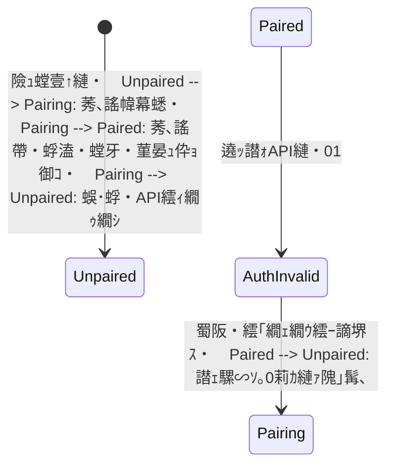

# Android謇灘綾繝ｪ繝ｼ繝€繝ｼ 蝓ｺ譛ｬ繝ｻ隧ｳ邏ｰ險ｭ險・
| 鬆・岼 | 蜀・ｮｹ |
|---|---|
| 蟇ｾ雎｡ | `flow-office-android-app` 蛻晄悄迚茨ｼ亥・譛臥ｫｯ譛ｫ繝｢繝ｼ繝会ｼ・|
| 蜿ら・繧ｷ繧ｹ繝・Β | `flow-office`・・aravel API / Sanctum / EventStore・・|
| 菴懈・譌･ | 2026-07-19 |
| 繧ｹ繝・・繧ｿ繧ｹ | Android螳溯｣・ｸｭ・・hase 1蝓ｺ逶､繝ｻ繝壹い繝ｪ繝ｳ繧ｰUI逹€謇具ｼ峨€・PI螂醍ｴ・・`flow-office`繝悶Λ繝ｳ繝～claude/time-clock-recorder-app-design-2lwxqb`・・026-07-19遒ｺ隱搾ｼ峨ｒ蝓ｺ貅悶→縺吶ｋ |

## 1. 逶ｮ逧・
譛ｬ繧｢繝励Μ縺ｯ縲∝女莉倡ｭ峨↓險ｭ鄂ｮ縺励◆Android遶ｯ譛ｫ縺ｧNFC繧ｫ繝ｼ繝峨ｒ隱ｭ縺ｿ蜿悶ｊ縲∵里蟄伜共諤邂｡逅・す繧ｹ繝・Β
`flow-office`縺ｸ蜃ｺ蜍､繝ｻ騾€蜍､繝ｻ莨第・髢句ｧ九・莨第・邨ゆｺ・・謇灘綾繧､繝吶Φ繝医ｒ騾√ｋ謇灘綾繝ｪ繝ｼ繝€繝ｼ縺ｧ縺ゅｋ縲・
蛻晄悄迚医・蜈ｱ譛臥ｫｯ譛ｫ繧貞ｮ梧・蟇ｾ雎｡縺ｨ縺吶ｋ縲らｫｯ譛ｫ縺ｮBearer繝医・繧ｯ繝ｳ縺ｯ縲後←縺ｮ遶ｯ譛ｫ縺九€阪ｒ隱崎ｨｼ縺励€¨FC遲峨・
隱崎ｨｼ繧ｭ繝ｼ縺ｯ縲瑚ｪｰ縺梧遠蛻ｻ縺励◆縺九€阪ｒ隗｣豎ｺ縺吶ｋ縲・ndroid蛛ｴ縺ｧ縺ｯ蜍､蜍呎凾髢薙ｄ谿区･ｭ譎る俣繧定ｨ育ｮ励○縺壹€∵遠蛻ｻ縺ｮ
謗｡蜿悶・豌ｸ邯壼喧繝ｻ驟埼€√→邨先棡陦ｨ遉ｺ縺縺代ｒ諡・≧縲・
## 2. 蜿ら・雉・侭縺ｨ迴ｾ陦瑚ｪｿ譟ｻ邨先棡

### 2.1 蜿ら・雉・侭

- Android謇灘綾繝ｪ繝ｼ繝€繝ｼ螳溯｣・欠遉ｺ譖ｸ・医Θ繝ｼ繧ｶ繝ｼ謠蝉ｾ幢ｼ・- `flow-office` 縺ｮ [繧｢繝ｼ繧ｭ繝・け繝√Ε譁ｹ驥拆(../../flow-office/docs/03-architecture.md)
- `flow-office` 縺ｮ [蜍､諤邂｡逅・Θ繝ｼ繧ｹ繧ｱ繝ｼ繧ｹ](../../flow-office/docs/07-usecases-attendance.md)
- `flow-office` 縺ｮ [DB繧ｹ繧ｭ繝ｼ繝枉(../../flow-office/docs/16-database-schema.md)
- `flow-office` 縺ｮ [遶ｯ譛ｫ邂｡逅・Θ繝ｼ繧ｹ繧ｱ繝ｼ繧ｹ](../../flow-office/docs/23-usecases-devices.md)
- `flow-office` 縺ｮ [隱崎ｨｼ繧ｭ繝ｼ邂｡逅・Θ繝ｼ繧ｹ繧ｱ繝ｼ繧ｹ](../../flow-office/docs/24-usecases-authentication-keys.md)
- 迴ｾ陦・[API繝ｫ繝ｼ繝・(../../flow-office/backend/routes/api.php)
- 迴ｾ陦・[AttendancePunchController](../../flow-office/backend/app/Http/Controllers/Api/AttendancePunchController.php)
- 迴ｾ陦・[RecordAttendancePunchHandler](../../flow-office/backend/app/Domain/Attendance/Handlers/RecordAttendancePunchHandler.php)

### 2.2 迴ｾ陦悟ｮ溯｣・〒遒ｺ隱阪〒縺阪◆莠矩・
| 鬆・岼 | 迴ｾ陦御ｻ墓ｧ・|
|---|---|
| API蝓ｺ蠎・| `/api` |
| 隱崎ｨｼ | Laravel Sanctum Bearer繝医・繧ｯ繝ｳ |
| 騾壼ｸｸ繝ｦ繝ｼ繧ｶ繝ｼ謇灘綾繝ｭ繧ｰ | `POST /api/attendance-punches` |
| 謇灘綾遞ｮ蛻･ | `clock_in`, `break_start`, `break_end`, `clock_out` |
| 譎ょ綾 | 繧ｪ繝輔そ繝・ヨ蠢・・SO 8601縲・B縺ｫ縺ｯ螢∵凾險域凾蛻ｻ縺ｨ`utc_offset_minutes`繧貞・髮｢菫晏ｭ・|
| 謇灘綾繝ｭ繧ｰ縺ｮ菴咲ｽｮ莉倥￠ | 蜿り€・Ο繧ｰ縲ょ共諤縺ｮ豁｣縺ｯ`attendance_days` / `attendance_breaks` |
| 謨ｴ蜷域凾縺ｮ蜿肴丐 | 蜷御ｸ€蜍､蜍呎律縺ｮ謇灘綾鄒､縺梧紛蜷医＠縺溷ｴ蜷医・縺ｿ譌･谺｡蜍､諤縺ｸ蜷梧悄 |
| 譖ｸ縺崎ｾｼ縺ｿ蜴溷援 | Command 竊・Handler 竊・EventStore縲ら憾諷句､画峩縺ｯ繧､繝吶Φ繝医ｒ險倬鹸 |
| 蜈ｱ譛臥ｫｯ譛ｫ逋ｻ骭ｲ | `POST /api/devices`・育ｮ｡逅・€・ｼ・|
| 繝壹い繝ｪ繝ｳ繧ｰ逋ｺ陦鯉ｼ丈ｺ､謠・| `POST /api/devices/{id}/pairing` / `POST /api/devices/pairing/exchange` |
| 遶ｯ譛ｫ謇灘綾 | `POST /api/device-punches`縲∥bility `recorder:punch` |
| 譛ｬ莠ｺ迚ｹ螳・| `POST /api/devices/identity/resolve` |
| 繝上・繝医ン繝ｼ繝・| `POST /api/devices/heartbeat` |
| 遶ｯ譛ｫID | DB閾ｪ蜍墓治逡ｪ縺ｮ謨ｴ謨ｰ |

### 2.3 Android騾｣謳ｺAPI縺ｮ螳溯｣・憾豕√→蟾ｮ蛻・
蜿ら・繝悶Λ繝ｳ繝√〒縺ｯ縲～devices`縲～device_roles`縲～device_scopes`縲～authentication_keys`縲・`authentication_key_device_rules`縺ｨ遶ｯ譛ｫ謇灘綾逕ｨ繧ｫ繝ｩ繝縺悟ｮ溯｣・ｸ医∩縺ｧ縺ゅｋ縲らｫｯ譛ｫAPI縺ｯ莠ｺ髢灘髄縺代・
`AttendancePunchController`縺ｨ蛻・屬縺輔ｌ縲∵怙邨ら噪縺ｫ蜈ｱ騾壹・`RecordAttendancePunch` Command繧貞他縺ｶ縲・
Android縺ｯ縲梧欠遉ｺ譖ｸ縺ｮ諠ｳ螳哽SON縲阪〒縺ｯ縺ｪ縺上€∵ｬ｡縺ｮ迴ｾ陦悟ｷｮ蛻・∈蜷医ｏ縺帙ｋ縲・
| 鬆・岼 | 謖・､ｺ譖ｸ縺ｮ諠ｳ螳・| 迴ｾ陦後ヰ繝・け繧ｨ繝ｳ繝・|
|---|---|---|
| 繝壹い繝ｪ繝ｳ繧ｰ謌仙粥繝医・繧ｯ繝ｳ | `access_token` | `token` |
| 遶ｯ譛ｫ謇€譛牙玄蛻・| `shared` | `organization_shared` |
| 遶ｯ譛ｫID | 萓九〒縺ｯ謨ｰ蛟､ | 謨ｰ蛟､縺ｧ遒ｺ螳・|
| 謇灘綾謌仙粥 | 遉ｾ蜩｡陦ｨ遉ｺ蜷阪ｒ諠ｳ螳・| `AttendancePunchResource`縲Ａuser_id`縺ｮ縺ｿ縺ｧ豌丞錐縺ｪ縺・|
| heartbeat譛ｬ譁・| OS縲∽ｻｶ謨ｰ縲∫ｫｯ譛ｫ譎ょ綾遲・| `app_version`縺縺代ｒ蜿嶺ｻ・|
| 繧ｨ繝ｩ繝ｼ蛻・ｲ・| `error_code`繧呈耳螂ｨ | 迴ｾ迥ｶ縺ｯ荳ｻ縺ｫ422縺ｮ`message` |
| 蜀ｪ遲画€ｧ | 遶ｯ譛ｫ蜊倅ｽ阪ｒ諠ｳ螳・| `idempotency_key`蜊倡峡縺ｮ蜈ｨ菴填NIQUE |

譛€蠕後・3轤ｹ縺ｯAndroid螳溯｣・ｒ豁｢繧√↑縺・€・TO繧堤樟陦後↓蜷医ｏ縺帙€∵ｰ丞錐縺ｯnullable縲”eartbeat縺ｯ
`app_version`縺縺代ｒ騾√ｊ縲√お繝ｩ繝ｼ縺ｯHTTP status繧堤ｬｬ荳€蛻､螳壹€∵里遏･message繧定｣懷勧蛻､螳壹→縺吶ｋ縲・螳牙ｮ壹＠縺歔error_code`遲峨∈縺ｮ謾ｹ蝟・€呵｣懊・19遶縺ｸ蛻・屬縺吶ｋ縲・
## 3. 繧ｹ繧ｳ繝ｼ繝・
### 3.1 蛻晄悄迚医↓蜷ｫ繧√ｋ

- 蜈ｱ譛臥ｫｯ譛ｫ縺ｮ謇句・蜉帙・繧｢繝ｪ繝ｳ繧ｰ
- 遶ｯ譛ｫ繝医・繧ｯ繝ｳ縺ｮ證怜捷蛹紋ｿ晏ｭ・- NFC UID隱ｭ蜿悶・豁｣隕丞喧繝ｻ騾｣邯夊ｪｭ蜿匁椛豁｢
- 4遞ｮ鬘槭・謇灘綾
- API騾∽ｿ｡蜑阪・Room菫晏ｭ・- 繧ｪ繝輔Λ繧､繝ｳ菫晏ｭ倥→WorkManager蜀埼€・- 蜷御ｸ€繧､繝吶Φ繝医・蜀ｪ遲蛾€∽ｿ｡
- 繧ｪ繝ｳ繝ｩ繧､繝ｳ・乗悴騾∽ｿ｡莉ｶ謨ｰ・冗ｵ先棡陦ｨ遉ｺ
- 401譎ゅ・蜀阪・繧｢繝ｪ繝ｳ繧ｰ隱伜ｰ・- 繝上・繝医ン繝ｼ繝・- 險ｭ螳壹・險ｺ譁ｭ繝ｻ螳牙・縺ｪ繝壹い繝ｪ繝ｳ繧ｰ隗｣髯､
- 蜊倅ｽ薙€．B縲・€壻ｿ｡縲仝orker縲，ompose UI繝・せ繝・
### 3.2 蛻晄悄迚医↓蜷ｫ繧√↑縺・
- QR繧ｳ繝ｼ繝峨€√ヰ繝ｼ繧ｳ繝ｼ繝峨€。LE縲∫函菴楢ｪ崎ｨｼ縺ｮ螳溯ｪｭ蜿・- 謇灘綾遞ｮ蛻･縺ｮ閾ｪ蜍墓耳螳・- Android蛛ｴ縺ｧ縺ｮ蜍､蜍吶・谿区･ｭ繝ｻ豺ｱ螟懈凾髢楢ｨ育ｮ・- 蛟倶ｺｺ遶ｯ譛ｫ逕ｨ繝ｦ繝ｼ繧ｶ繝ｼ繝医・繧ｯ繝ｳ縺ｮ諱剃ｹ・ｿ晏ｭ・- 蜴ｳ蟇・↑繝ｪ繧｢繝ｫ繧ｿ繧､繝遶ｯ譛ｫ逶｣隕・- MDM驟榊ｸ・・繧ｭ繧ｪ繧ｹ繧ｯ蛹厄ｼ亥ｰ・擂縺ｮ驕狗畑隱ｲ鬘鯉ｼ・
## 4. 繧ｷ繧ｹ繝・Β讒区・

```mermaid
flowchart LR
    Card["NFC繧ｫ繝ｼ繝・] --> Reader["Android謇灘綾繝ｪ繝ｼ繝€繝ｼ"]
    Reader --> Room["Room: 謇灘綾驟埼€√く繝･繝ｼ"]
    Reader --> Secure["Keystore菫晁ｭｷ繧ｹ繝医Ξ繝ｼ繧ｸ"]
    Room --> Worker["WorkManager"]
    Reader -->|"蜊ｳ譎る€∽ｿ｡"| API["flow-office Device API"]
    Worker -->|"蜀埼€・| API
    API --> Key["遉ｾ蜩｡隱崎ｨｼ繧ｭ繝ｼ隗｣豎ｺ"]
    API --> Punch["attendance_punches"]
    Punch --> Reconcile["譌｢蟄倥・謇灘綾謨ｴ蜷医・譌･谺｡蜷梧悄"]
    Reconcile --> Daily["attendance_days / attendance_breaks"]
    API --> Events["stored_events"]
```

### 4.1 雋ｬ蜍吝｢・阜

| Android | flow-office |
|---|---|
| NFC遲峨°繧芽ｪ崎ｨｼ繧ｭ繝ｼ繧呈治蜿・| 隱崎ｨｼ繧ｭ繝ｼ縺九ｉ遉ｾ蜩｡繧堤音螳・|
| 謫堺ｽ懈凾蛻ｻ縺ｨUTC繧ｪ繝輔そ繝・ヨ繧呈治蜿・| 蜈･蜉帶､懆ｨｼ繝ｻ隱榊庄繝ｻ逶｣譟ｻ |
| 謇灘綾繧､繝吶Φ繝医ｒ騾∽ｿ｡蜑阪↓豌ｸ邯壼喧 | 蜀ｪ遲画€ｧ繧剃ｿ晁ｨｼ縺励※謇灘綾繝ｭ繧ｰ繧定ｨ倬鹸 |
| 騾壻ｿ｡螟ｱ謨玲凾縺ｫ蜷後§繧ｭ繝ｼ縺ｧ蜀埼€・| 謇灘綾鄒､縺九ｉ譌･谺｡蜍､諤繧堤ｵ・∩遶九※繧・|
| 繧ｵ繝ｼ繝舌・邨先棡繧定｡ｨ遉ｺ | 蜍､蜍呎凾髢鍋ｭ峨ｒ險育ｮ・|

## 5. Android繧｢繝ｼ繧ｭ繝・け繝√Ε

### 5.1 謗｡逕ｨ謚€陦・
- Kotlin縲゛etpack Compose縲｀aterial 3
- ViewModel縲´ifecycle縲¨avigation Compose
- Coroutines / Flow
- Hilt
- Retrofit縲＾kHttp縲〔otlinx.serialization
- Room
- WorkManager
- Android Keystore繧貞茜逕ｨ縺励◆證怜捷蛹悶せ繝医Ξ繝ｼ繧ｸ
- Android NFC API

蝓ｺ譛ｬ譁ｹ驥昴・縲゜eystore蜀・・髱槭お繧ｯ繧ｹ繝昴・繝磯嵯縺ｧ繝医・繧ｯ繝ｳ繧但ES-GCM證怜捷蛹悶＠縲∵囓蜿ｷ譁・・IV繝ｻ髱樊ｩ溷ｯ・ｨｭ螳壹ｒ
DataStore縺ｸ菫晏ｭ倥☆繧区婿蠑上→縺吶ｋ縲よ囓蜿ｷ蛹悶せ繝医Ξ繝ｼ繧ｸ縺ｯ`DeviceTokenStore` interface縺ｮ蜀・・縺ｸ髢峨§霎ｼ繧√€・謗｡逕ｨ繝ｩ繧､繝悶Λ繝ｪ繧貞､画峩縺励※繧Ｂpplication/domain螻､縺ｸ蠖ｱ髻ｿ縺輔○縺ｪ縺・€・
### 5.2 繝｢繧ｸ繝･繝ｼ繝ｫ譁ｹ驥・
蛻晄悄迚医・蜊倅ｸ€`app` Gradle繝｢繧ｸ繝･繝ｼ繝ｫ縺ｨ縺励€√ヱ繝・こ繝ｼ繧ｸ縺ｧ雋ｬ蜍吶ｒ蛻・屬縺吶ｋ縲りｦ乗ｨ｡縺悟｢励∴縺滓凾轤ｹ縺ｧ
`core:network`縲～core:database`遲峨∈蛻・牡縺ｧ縺阪ｋ萓晏ｭ俶婿蜷代ｒ螳医ｋ縲・
```text
jp.co.xsys.flowoffice
笏懌楳笏€ app
笏・  笏懌楳笏€ FlowOfficeReaderApplication
笏・  笏懌楳笏€ MainActivity
笏・  笏披楳笏€ navigation
笏懌楳笏€ presentation
笏・  笏懌楳笏€ pairing
笏・  笏懌楳笏€ punch
笏・  笏懌楳笏€ settings
笏・  笏披楳笏€ diagnostics
笏懌楳笏€ application
笏・  笏懌楳笏€ pairing
笏・  笏懌楳笏€ punch
笏・  笏懌楳笏€ sync
笏・  笏披楳笏€ heartbeat
笏懌楳笏€ domain
笏・  笏懌楳笏€ device
笏・  笏懌楳笏€ identity
笏・  笏懌楳笏€ punch
笏・  笏披楳笏€ error
笏懌楳笏€ data
笏・  笏懌楳笏€ remote
笏・  笏懌楳笏€ local
笏・  笏懌楳笏€ repository
笏・  笏披楳笏€ security
笏披楳笏€ infrastructure
    笏懌楳笏€ nfc
    笏懌楳笏€ network
    笏懌楳笏€ worker
    笏披楳笏€ logging
```

萓晏ｭ俶婿蜷代・`presentation 竊・application 竊・domain`縺ｨ縺励€～data`縺ｨ`infrastructure`縺ｯdomain縺ｧ螳夂ｾｩ縺励◆
interface繧貞ｮ溯｣・☆繧九€７iewModel縺九ｉRetrofit繧ДAO繧堤峩謗･蜻ｼ縺ｰ縺ｪ縺・€・
### 5.3 荳ｻ縺ｪ繧ｳ繝ｳ繝昴・繝阪Φ繝・
| 繧ｳ繝ｳ繝昴・繝阪Φ繝・| 雋ｬ蜍・|
|---|---|
| `PairingViewModel` | 蜈･蜉帶､懆ｨｼ縲∽ｺ､謠婉seCase螳溯｡後€∫判髱｢驕ｷ遘ｻ |
| `PunchViewModel` | 謇灘綾遞ｮ蛻･縲¨FC蠕・女縲・€壻ｿ｡繝ｻ譛ｪ騾∽ｿ｡繝ｻ邨先棡縺ｮUI迥ｶ諷・|
| `DiagnosticsViewModel` | 髱樒ｧ伜ｯ・・遶ｯ譛ｫ迥ｶ諷九・螟ｱ謨励く繝･繝ｼ陦ｨ遉ｺ |
| `ExchangePairingCodeUseCase` | 繧ｳ繝ｼ繝我ｺ､謠帙€√ヨ繝ｼ繧ｯ繝ｳ縺ｨ遶ｯ譛ｫ險ｭ螳壹・荳€諡ｬ菫晏ｭ・|
| `CreatePunchUseCase` | 繧､繝吶Φ繝育函謌舌€ヽoom菫晏ｭ倥€∝叉譎る€∽ｿ｡ |
| `RetryPendingPunchesUseCase` | 蜿､縺・遠蛻ｻ縺九ｉ1莉ｶ縺壹▽驟埼€√€∫憾諷句・鬘・|
| `SendHeartbeatUseCase` | 遞ｼ蜒肴ュ蝣ｱ騾∽ｿ｡ |
| `NfcAuthenticationKeyReader` | Tag ID隱ｭ蜿悶→domain蝙九∈縺ｮ螟画鋤 |
| `DeviceTokenStore` | 繝医・繧ｯ繝ｳ縺ｮ證怜捷蛹悶・蠕ｩ蜿ｷ繝ｻ蜑企勁 |
| `PunchSyncWorker` | 繝阪ャ繝医Ρ繝ｼ繧ｯ蛻ｶ邏・ｻ倥″蜀埼€・|

## 6. 繝峨Γ繧､繝ｳ繝｢繝・Ν

```kotlin
@JvmInline
value class DeviceId(val value: Long)

data class AuthenticationKey(
    val type: AuthenticationKeyType,
    val rawValue: String,
)

enum class AuthenticationKeyType { NFC_UID, QR_CODE, BARCODE, EXTERNAL, UNKNOWN }

enum class PunchType(val apiValue: String) {
    CLOCK_IN("clock_in"),
    CLOCK_OUT("clock_out"),
    BREAK_START("break_start"),
    BREAK_END("break_end"),
}

enum class DeviceOwnershipType { SHARED, PERSONAL, EXTERNAL }

data class PunchEvent(
    val localId: String,
    val idempotencyKey: String,
    val workDate: LocalDate,
    val punchType: PunchType,
    val punchedAt: OffsetDateTime,
    val authenticationKeyValue: String?,
    val offlineAtCreation: Boolean,
    val note: String?,
)
```

`flow-office`縺ｮ`devices.id`縺ｯ閾ｪ蜍墓治逡ｪ謨ｴ謨ｰ縺ｨ縺励※螳溯｣・ｸ医∩縺ｪ縺ｮ縺ｧ縲、ndroid繧ＡLong`縺ｧ菫晄戟縺吶ｋ縲・
## 7. 迥ｶ諷玖ｨｭ險・
### 7.1 繧｢繝励Μ・上・繧｢繝ｪ繝ｳ繧ｰ迥ｶ諷・


401縺縺代〒繝医・繧ｯ繝ｳ繧貞炎髯､縺励↑縺・€ＡAuthInvalid`縺ｧ縺ｯ閾ｪ蜍募・騾√ｒ蛛懈ｭ｢縺励€∵悴騾∽ｿ｡繝・・繧ｿ繧堤ｶｭ謖√＠縺溘∪縺ｾ
邂｡逅・€・｢ｺ隱阪→蜀阪・繧｢繝ｪ繝ｳ繧ｰ繧呈｡亥・縺吶ｋ縲・
### 7.2 謇灘綾驟埼€∫憾諷・
| 迥ｶ諷・| 諢丞袖 | 谺｡縺ｮ迥ｶ諷・|
|---|---|---|
| `pending` | 騾∽ｿ｡蠕・■ | `sending` |
| `sending` | 謗剃ｻ門叙蠕怜ｾ後・騾∽ｿ｡荳ｭ | `sent`, `failed_retryable`, `failed_permanent`, `pending_auth` |
| `failed_retryable` | 騾壻ｿ｡萓句､悶€・29縲・xx | `sending` |
| `pending_auth` | 401縺ｧ隱崎ｨｼ蠕ｩ譌ｧ蠕・■ | 蜀阪・繧｢繝ｪ繝ｳ繧ｰ蠕後↓`pending` |
| `failed_permanent` | 422遲峨€∝酔縺伜・螳ｹ縺ｧ縺ｯ謌仙粥縺励↑縺・| 謇句虚遒ｺ隱阪・縺ｿ |
| `sent` | 繧ｵ繝ｼ繝舌・蜿礼炊貂医∩ | 邨らｫｯ |

繝励Ο繧ｻ繧ｹ蠑ｷ蛻ｶ邨ゆｺ・〒`sending`縺梧ｮ九ｋ蝣ｴ蜷医↓蛯吶∴縲・幕蟋九°繧我ｸ€螳壽凾髢難ｼ井ｾ・ 10蛻・ｼ臥ｵ碁℃縺励◆陦後ｒ
`failed_retryable`縺ｸ謌ｻ縺吶Μ繧ｫ繝舌Μ繧淡orker襍ｷ蜍墓凾縺ｫ陦後≧縲・
## 8. NFC險ｭ險・
### 8.1 隱ｭ蜿・
- 遶ｯ譛ｫ縺君FC蟇ｾ蠢懊°縲∬ｨｭ螳壹〒譛牙柑縺九ｒ險ｺ譁ｭ逕ｻ髱｢縺ｸ陦ｨ遉ｺ縺吶ｋ縲・- Compose逕ｻ髱｢陦ｨ遉ｺ荳ｭ縺ｯReader Mode繧呈怏蜉ｹ蛹悶＠縲∫判髱｢髮｢閼ｱ譎ゅ↓隗｣髯､縺吶ｋ縲・- UID縺ｮ繝舌う繝亥・繧貞､ｧ譁・ｭ・6騾ｲ縲∝玄蛻・ｊ繝ｻ遨ｺ逋ｽ繝ｻ`0x`縺ｪ縺励∈豁｣隕丞喧縺吶ｋ縲・- 遨ｺ縺ｮUID縲∝ｯｾ蠢懷､傍ag縲∬ｪｭ蜿紋ｾ句､悶・謇灘綾繧､繝吶Φ繝医ｒ菴懊ｉ縺ｪ縺・€・- NFC UID縺ｯ鬮倅ｿ晁ｨｼ縺ｮ譛ｬ莠ｺ隱崎ｨｼ縺ｧ縺ｯ縺ｪ縺剰ｭ伜挨繧ｭ繝ｼ縺ｨ縺励※謇ｱ縺・€・
```kotlin
fun ByteArray.toNormalizedNfcUid(): String =
    joinToString(separator = "") { byte -> "%02X".format(byte.toInt() and 0xFF) }
```

### 8.2 騾｣邯夊ｪｭ蜿匁椛豁｢

- 蜷後§豁｣隕丞喧貂医∩繧ｭ繝ｼ縺ｮ蜀崎ｪｭ蜿悶ｒ3遘帝俣辟｡隕悶☆繧九€・- 蛻､螳壼€､縺ｯ繝｡繝｢繝ｪ荳翫□縺代↓鄂ｮ縺阪€ゞID閾ｪ菴薙ｒ繝ｭ繧ｰ縺ｸ蜃ｺ縺輔↑縺・€・- 3遘呈椛豁｢縺ｯUX蟇ｾ遲悶〒縺ゅｊ縲√し繝ｼ繝舌・蜀ｪ遲画€ｧ縺ｮ莉｣譖ｿ縺ｫ縺励↑縺・€・- 1蝗槭・譛牙柑隱ｭ蜿悶↓縺､縺阪€・縺､縺ｮ`idempotency_key`縺縺代ｒ逕滓・縺吶ｋ縲・
## 9. 繝ｭ繝ｼ繧ｫ繝ｫ繝・・繧ｿ險ｭ險・
### 9.1 `pending_punches`

| 繧ｫ繝ｩ繝 | 蝙・| 蛻ｶ邏・ｼ冗畑騾・|
|---|---|---|
| `local_id` | TEXT | PK縲ゞUID v7謗ｨ螂ｨ |
| `idempotency_key` | TEXT | UNIQUE縲∝・騾∽ｸｭ縺ｫ荳榊､・|
| `work_date` | TEXT | `YYYY-MM-DD` |
| `punch_type` | TEXT | 4遞ｮ鬘・|
| `punched_at` | TEXT | 繧ｪ繝輔そ繝・ヨ莉倥″ISO 8601 |
| `authentication_key_value` | TEXT | 騾∽ｿ｡螳御ｺ・∪縺ｧ蠢・ｦ√€ゅΟ繧ｰ繝ｻ逕ｻ髱｢縺ｫ髱櫁｡ｨ遉ｺ |
| `note` | TEXT NULL | 莉ｻ諢・|
| `offline_at_creation` | INTEGER | 菴懈・譎る€壻ｿ｡迥ｶ諷・|
| `status` | TEXT | 驟埼€∫憾諷・|
| `attempt_count` | INTEGER | 隧ｦ陦悟屓謨ｰ |
| `last_attempt_at` | TEXT NULL | 譛€邨りｩｦ陦梧凾蛻ｻ |
| `last_error_code` | TEXT NULL | 螳牙ｮ壹＠縺蘗PI繧ｨ繝ｩ繝ｼ繧ｳ繝ｼ繝・|
| `last_error_message` | TEXT NULL | 遘伜ｯ・ｒ髯､蜴ｻ縺励◆險ｺ譁ｭ譁・|
| `server_punch_id` | TEXT NULL | 謌仙粥蠢懃ｭ斐・ID |
| `server_response_json` | TEXT NULL | 蜴溷援菫晏ｭ倥＠縺ｪ縺・€ょｿ・ｦ・・岼縺縺大・縺ｸ菫晏ｭ・|
| `created_at` | TEXT | 繝ｭ繝ｼ繧ｫ繝ｫ菫晏ｭ俶凾蛻ｻ |
| `sent_at` | TEXT NULL | 繧ｵ繝ｼ繝舌・騾∽ｿ｡螳御ｺ・凾蛻ｻ |

隱崎ｨｼ繧ｭ繝ｼ縺ｯ譛ｪ騾∽ｿ｡荳ｭ縺ｫ蠢・ｦ√↑蛟倶ｺｺ隴伜挨繝・・繧ｿ縺ｧ縺ゅｋ縲・B證怜捷蛹悶ｒ蛻晄悄迚医〒謗｡逕ｨ縺励↑縺・ｴ蜷医・縲・繧｢繝励Μ蟆ら畑蜀・Κ繧ｹ繝医Ξ繝ｼ繧ｸ縲√ヰ繝・け繧｢繝・・髯､螟悶€～sent`蠕後・繧ｭ繝ｼ豸亥悉縲∫洒縺・ｿ晄戟譛滄俣繧貞ｿ・医→縺吶ｋ縲・`sent`陦後・險ｺ譁ｭ縺ｫ蠢・ｦ√↑譛€蟆乗ュ蝣ｱ縺縺第ｮ九＠縲∝ｮ壽悄逧・↓蜑企勁縺吶ｋ縲・
### 9.2 `device_configuration`

遶ｯ譛ｫID縲∫ｫｯ譛ｫ蜷阪€｛wnership縲、PI蝓ｺ蠎俵RL縲｝airedAt繧奪ataStore縺ｸ菫晏ｭ倥☆繧九€・earer繝医・繧ｯ繝ｳ縺縺代・
證怜捷蛹悶＠縺ｦ蛻･繧ｭ繝ｼ縺ｧ菫晏ｭ倥＠縲∬ｨｭ螳壹ョ繝ｼ繧ｿ縺ｮdump縺ｫ豺ｷ蝨ｨ縺輔○縺ｪ縺・€・PI蝓ｺ蠎俵RL螟画峩縺ｯ髢狗匱繝薙Ν繝峨□縺・險ｱ蜿ｯ縺励€∵悽逡ｪ縺ｯ繝薙Ν繝芽ｨｭ螳壹〒蝗ｺ螳壹☆繧九€・
### 9.3 Room繝医Λ繝ｳ繧ｶ繧ｯ繧ｷ繝ｧ繝ｳ縺ｨ謗剃ｻ・
1. NFC蜿嶺ｻ俶凾縺ｫ`pending`繧段nsert縺吶ｋ縲・2. 騾∽ｿ｡蜃ｦ逅・・DB繝医Λ繝ｳ繧ｶ繧ｯ繧ｷ繝ｧ繝ｳ縺ｧ譛€蜿､縺ｮ騾∽ｿ｡蟇ｾ雎｡繧蛋pending/failed_retryable`縺九ｉ`sending`縺ｸ譖ｴ譁ｰ縺吶ｋ縲・3. 蜊ｳ譎る€∽ｿ｡縺ｨWorker縺ｯ蜷後§驟埼€√け繝ｩ繧ｹ繧剃ｽｿ縺・€∝酔縺倩｡後ｒ蜷梧凾騾∽ｿ｡縺励↑縺・€・4. 謌仙粥繝ｻ螟ｱ謨玲峩譁ｰ繧ゅヨ繝ｩ繝ｳ繧ｶ繧ｯ繧ｷ繝ｧ繝ｳ縺ｧ陦後≧縲・
## 10. 騾壻ｿ｡繝ｻ蜷梧悄險ｭ險・
### 10.1 HTTP繧ｯ繝ｩ繧､繧｢繝ｳ繝・
- Base URL縺ｯ蠢・★譛ｫ蟆ｾ`/`繧呈戟縺､縲・- 蜈ｱ騾壹〒`Accept: application/json`繧剃ｻ倥￠繧九€・- JSON譛ｬ譁・凾縺縺疏Content-Type: application/json`繧剃ｻ倥￠繧九€・- 繝壹い繝ｪ繝ｳ繧ｰ莠､謠帷畑繧ｯ繝ｩ繧､繧｢繝ｳ繝医↓縺ｯAuthorization interceptor繧剃ｻ倥￠縺ｪ縺・€・- 遶ｯ譛ｫAPI逕ｨ繧ｯ繝ｩ繧､繧｢繝ｳ繝医・菫晏ｭ俶ｸ医∩繝医・繧ｯ繝ｳ縺後≠繧区凾縺縺腺earer繧剃ｻ倥￠繧九€・- HTTP body logging縺ｯ譛ｬ逡ｪ辟｡蜉ｹ縲る幕逋ｺ縺ｧ繧・uthorization縲｝airing code縲∬ｪ崎ｨｼ繧ｭ繝ｼ繧池edact縺吶ｋ縲・- 謗･邯壹・隱ｭ蜿悶・譖ｸ霎ｼtimeout繧呈・遉ｺ縺励€・€壻ｿ｡萓句､悶ｒdomain縺ｮ`AppError`縺ｸ螟画鋤縺吶ｋ縲・
### 10.2 謇灘綾繧ｷ繝ｼ繧ｱ繝ｳ繧ｹ

```mermaid
sequenceDiagram
    actor Employee as 遉ｾ蜩｡
    participant UI as PunchScreen
    participant UC as CreatePunchUseCase
    participant DB as Room
    participant API as DevicePunch API
    Employee->>UI: 謇灘綾遞ｮ蛻･繧帝∈謚槭＠繧ｫ繝ｼ繝峨ｒ縺九＊縺・    UI->>UC: 豁｣隕丞喧貂医∩隱崎ｨｼ繧ｭ繝ｼ + 遶ｯ譛ｫ譎ょ綾
    UC->>UC: localId / idempotencyKey繧剃ｸ€蠎ｦ縺縺醍函謌・    UC->>DB: pending繧剃ｿ晏ｭ・    alt 繧ｪ繝ｳ繝ｩ繧､繝ｳ
        UC->>DB: sending縺ｸ謗剃ｻ匁峩譁ｰ
        UC->>API: POST /device-punches
        alt 謌仙粥縺ｾ縺溘・蜷御ｸ€蜀ｪ遲峨く繝ｼ縺ｮ譌｢蟄倡ｵ先棡
            API-->>UC: 謇灘綾邨先棡
            UC->>DB: sent縺ｸ譖ｴ譁ｰ繝ｻ隱崎ｨｼ繧ｭ繝ｼ豸亥悉
            UC-->>UI: 謌仙粥陦ｨ遉ｺ
        else 蜀崎ｩｦ陦悟庄閭ｽ
            UC->>DB: failed_retryable
            UC-->>UI: 遶ｯ譛ｫ菫晏ｭ俶ｸ医∩陦ｨ遉ｺ
        else 諱剃ｹ・お繝ｩ繝ｼ
            UC->>DB: failed_permanent
            UC-->>UI: 繧ｨ繝ｩ繝ｼ陦ｨ遉ｺ
        end
    else 繧ｪ繝輔Λ繧､繝ｳ
        UC-->>UI: 繧ｪ繝輔Λ繧､繝ｳ菫晏ｭ俶ｸ医∩陦ｨ遉ｺ
    end
```

### 10.3 WorkManager

- `NetworkType.CONNECTED`蛻ｶ邏・ｒ菴ｿ縺・€・- Unique Work蜷阪ｒ蝗ｺ螳壹＠縲・㍾隍Ⅳorker繧帝∩縺代ｋ縲・- 繧ｪ繝ｳ繝・・繝ｳ繝牙・騾√→螳壽悄蜀埼€√ｒ蜷後§UseCase縺ｸ謗･邯壹☆繧九€・- `punched_at`, `created_at`譏・・〒1莉ｶ縺壹▽騾√ｋ縲・- 429縺ｮ`Retry-After`繧貞ｰ企㍾縺励€√◎繧御ｻ･螟悶・謖・焚繝舌ャ繧ｯ繧ｪ繝輔ｒ菴ｿ縺・€・- Worker縺ｮ蜈･蜉侫ata縺ｫ繝医・繧ｯ繝ｳ繧・ｪ崎ｨｼ繧ｭ繝ｼ繧呈ｼ邏阪＠縺ｪ縺・€・B縺ｮ`local_id`縺縺代ｒ貂｡縺吶€・- 401繧貞女縺代◆繧牙ｾ檎ｶ夐€∽ｿ｡繧呈ｭ｢繧√ｋ縲・
### 10.4 work_date

迴ｾ陦形flow-office`縺ｧ縺ｯ縲御ｻ頑律縲阪・遉ｾ蜩｡縺ｮ`users.timezone`縺ｧ豎ｺ繧√ｋ縺後€∝・譛臥ｫｯ譛ｫ縺ｯ隱崎ｨｼ繧ｭ繝ｼ繧定ｧ｣豎ｺ縺吶ｋ
蜑阪↓遉ｾ蜩｡縺ｮtimezone繧堤衍繧峨↑縺・€ょ､懷共縺ｮ譌･霍ｨ縺弱ｂ縺ゅｋ縺溘ａ縲∫ｫｯ譛ｫ繝ｭ繝ｼ繧ｫ繝ｫ譌･莉倥□縺代〒縺ｯ遒ｺ螳壹〒縺阪↑縺・€・
迴ｾ陦後ヰ繝・け繧ｨ繝ｳ繝峨・騾∽ｿ｡縺輔ｌ縺歔work_date`繧偵◎縺ｮ縺ｾ縺ｾ菫晏ｭ倥＠縲∫､ｾ蜩｡timezone繧・共蜍吩ｺ亥ｮ壹↓繧医ｋ陬懈ｭ｣繧・陦後ｏ縺ｪ縺・€ょ・譛溷ｮ溯｣・・遶ｯ譛ｫ繝ｭ繝ｼ繧ｫ繝ｫ譌･莉倥ｒ菴ｿ縺・€ょ､懷共繝ｻ譌･霍ｨ縺弱・譌｢遏･縺ｮ蛻ｶ邏・→縺励※險ｺ譁ｭ諠・ｱ縺ｸ谿九＠縲・蜍､蜍呎律蛻､螳哂PI縺ｾ縺溘・遶ｯ譛ｫ蛻･縺ｮ蜍､蜍呎律蠅・阜縺後ヰ繝・け繧ｨ繝ｳ繝峨∈霑ｽ蜉縺輔ｌ縺滓ｮｵ髫弱〒resolver繧貞ｷｮ縺玲崛縺医ｋ縲・
## 11. API螂醍ｴ・ｼ育樟陦悟ｮ溯｣・ｼ・
譛ｬ遶縺ｯ`flow-office`縺ｮController縲ヽesource縲：eature Test縺ｧ遒ｺ隱阪＠縺溽樟陦悟･醍ｴ・〒縺ゅｋ縲ゅΞ繧ｹ繝昴Φ繧ｹ縺ｫ
蟄伜惠縺励↑縺・€､縺ｯAndroid DTO縺ｧnullable縺ｫ縺励€∵耳貂ｬ縺ｧ蠢・亥喧縺励↑縺・€・
### 11.1 繝壹い繝ｪ繝ｳ繧ｰ莠､謠・
`POST /api/devices/pairing/exchange`縺ｯ隱崎ｨｼ縺ｪ縺励〒蜻ｼ縺ｶ縲らｫｯ譛ｫID縺ｯ謨ｴ謨ｰ縲∫ｮ｡逅・判髱｢縺檎匱陦後☆繧九さ繝ｼ繝峨・
8譁・ｭ励€∵怏蜉ｹ譛滄剞15蛻・€√ワ繝・す繝･菫晏ｭ倥€∽ｺ､謠帛ｾ後↓遐ｴ譽・＆繧後ｋ縲・
```json
{
  "device_id": 123,
  "pairing_code": "A1B2C3D4"
}
```

```json
{
  "device": {
    "id": 123,
    "owner_type": "organization_shared",
    "name": "蜷榊商螻区悽遉ｾ蜈･蜿｣",
    "device_type": "android",
    "status": "active",
    "allowed_punch_types": null,
    "allow_offline": true,
    "auto_detect_punch_type": false,
    "paired_at": "2026-07-19T09:00:00+09:00"
  },
  "token": "1|..."
}
```

Android DTO縺ｯ`access_token`縺ｧ縺ｯ縺ｪ縺汁token`繧定ｪｭ繧€縲ゆｺ､謠帶凾轤ｹ縺ｧ遶ｯ譛ｫrole逕ｱ譚･縺ｮSanctum ability
・亥・譛画遠蛻ｻ遶ｯ譛ｫ縺ｯ`recorder:punch`・峨′逋ｺ陦後＆繧後ｋ縲・
### 11.2 譛ｬ莠ｺ迚ｹ螳・
`POST /api/devices/identity/resolve`・・bility `identity:resolve`縺ｾ縺溘・`recorder:punch`・・
```json
{ "authentication_key_value": "04A22419CC2180" }
```

```json
{
  "user_id": 42,
  "name": "豌ｸ驥・繧・≧縺ｨ",
  "authentication_key_id": 10
}
```

騾壼ｸｸ謇灘綾縺ｯ`POST /device-punches`蜀・〒隱崎ｨｼ繧ｭ繝ｼ繧貞・隗｣豎ｺ縺吶ｋ縲よ悽莠ｺ迚ｹ螳哂PI縺ｯ險ｺ譁ｭ縺ｾ縺溘・迚ｹ谿翫↑
莠句燕陦ｨ遉ｺ繝｢繝ｼ繝峨□縺代↓菴ｿ縺・€√◎縺ｮ邨先棡繧呈遠蛻ｻ縺ｮ隱崎ｨｼ貂医∩險ｼ譏弱→縺励※謇ｱ繧上↑縺・€・
### 11.3 遶ｯ譛ｫ謇灘綾

`POST /api/device-punches`・亥・譛臥ｫｯ譛ｫ縺ｯability `recorder:punch`・・
```json
{
  "work_date": "2026-07-19",
  "punch_type": "clock_in",
  "punched_at": "2026-07-19T09:00:12+09:00",
  "authentication_key_value": "04A22419CC2180",
  "offline": false,
  "idempotency_key": "019bbcae-a85b-7000-9d28-82ea9dfe8c21",
  "note": null
}
```

蜈ｱ譛臥ｫｯ譛ｫ縺ｧ縺ｯ`authentication_key_value`縺悟ｮ溯ｳｪ蠢・医〒縺ゅｋ縲よ・蜉溘・迴ｾ迥ｶ`200 OK`縺ｧ
`AttendancePunchResource`繧定ｿ斐☆縲・
```json
{
  "id": 4567,
  "user_id": 42,
  "work_date": "2026-07-19",
  "punch_type": "clock_in",
  "punched_at": "2026-07-19T09:00:12+09:00",
  "source": "device:android",
  "device_id": 123,
  "authentication_key_id": 10,
  "actor_user_id": 42,
  "offline": false,
  "note": null,
  "status": "active",
  "created_at": "2026-07-19T09:00:13+09:00"
}
```

繝ｬ繧ｹ繝昴Φ繧ｹ縺ｫ遉ｾ蜩｡蜷阪€～idempotency_key`縲√し繝ｼ繝舌・蜿嶺ｿ｡譎ょ綾縲∝茜逕ｨ閠・髄縺僧essage縺ｯ縺ｪ縺・€ゅ＠縺溘′縺｣縺ｦ
蛻晄悄迚医・謌仙粥陦ｨ遉ｺ縺ｯ謇灘綾遞ｮ蛻･縺ｨ譎ょ綾繧剃ｸｻ縺ｨ縺励€∫､ｾ蜩｡蜷阪・莠句燕resolve繧呈怏蜉ｹ縺ｫ縺励◆蝣ｴ蜷医□縺題｡ｨ遉ｺ縺吶ｋ縲・蜷御ｸ€`idempotency_key`縺ｮ蜀埼€√・譌｢蟄倩｡後ｒ霑斐＠縲∵眠縺励＞謇灘綾繧剃ｽ懊ｉ縺ｪ縺・€・
### 11.4 繝上・繝医ン繝ｼ繝・
`POST /api/devices/heartbeat`縺ｯ`auth:sanctum`驟堺ｸ九〒縲∝・譛画遠蛻ｻ遶ｯ譛ｫ縺ｮ`recorder:punch`縺ｧ繧ょ他縺ｹ繧九€・迴ｾ陦後・蜿嶺ｻ俶悽譁・・谺｡縺縺代〒縺ゅｋ縲・
```json
{ "app_version": "1.0.0" }
```

謌仙粥譎ゅ・譖ｴ譁ｰ蠕後・`DeviceResource`繧蛋200 OK`縺ｧ霑斐＠縲√し繝ｼ繝舌・縺形last_seen_at`繧呈峩譁ｰ縺吶ｋ縲・OS繝舌・繧ｸ繝ｧ繝ｳ縲∵悴騾∽ｿ｡莉ｶ謨ｰ縲∫ｫｯ譛ｫ譎ょ綾縺ｯ迴ｾ陦窟PI縺ｸ騾√ｉ縺ｪ縺・€・
### 11.5 繧ｨ繝ｩ繝ｼ譛ｬ譁・
Laravel validation縺ｯ`message`縺ｨ`errors`縲√ラ繝｡繧､繝ｳ繝ｫ繝ｼ繝ｫ驕募渚縺ｯ荳ｻ縺ｫ`message`繧定ｿ斐☆縲ょｮ牙ｮ壹＠縺・`error_code`縺ｯ譛ｪ螳溯｣・・縺溘ａ縲、ndroid縺ｮ蛻ｶ蠕｡縺ｯHTTP status繧堤ｬｬ荳€縺ｫ縺吶ｋ縲・22縺ｮ蛻ｩ逕ｨ閠・髄縺第枚險€縺ｯ
隱崎ｨｼ繧ｭ繝ｼ髢｢騾｣縺ｪ縺ｩ螳牙・縺ｨ遒ｺ隱阪〒縺阪◆譌｢遏･繧ｱ繝ｼ繧ｹ縺縺代ｒ螟画鋤縺励€∵悴遏･縺ｮ繧ｵ繝ｼ繝舌・譁・ｨ€縺ｯ縺昴・縺ｾ縺ｾ陦ｨ遉ｺ縺励↑縺・€・
## 12. 繝舌ャ繧ｯ繧ｨ繝ｳ繝蛾€｣謳ｺ險ｭ險茨ｼ亥ｮ溯｣・｢ｺ隱搾ｼ・
### 12.1 隱崎ｨｼ縺ｨ隱榊庄

- `Device`縺ｯSanctum `HasApiTokens`繧呈戟縺､隱崎ｨｼ荳ｻ菴薙〒縺ゅｋ縲・- 莠ｺ髢灘髄縺鷹€壼ｸｸ繝医・繧ｯ繝ｳ縺ｯability `*`縲∝・譛画遠蛻ｻ遶ｯ譛ｫ縺ｯ`recorder:punch`縺ｧ蛻・屬縺輔ｌ繧九€・- 髯仙ｮ壹ヨ繝ｼ繧ｯ繝ｳ縺ｯability縺梧・險倥＆繧後◆繝ｫ繝ｼ繝井ｻ･螟悶ｒ繧ｰ繝ｭ繝ｼ繝舌Νmiddleware縺ｧ諡貞凄縺吶ｋ縲・- `DevicePunchController`縺ｯ隱崎ｨｼ荳ｻ菴薙′`Device`縺ｧ縺ゅｋ縺薙→繧堤｢ｺ隱阪＠縲∝・譛臥ｫｯ譛ｫ縺ｧ縺ｯ隱崎ｨｼ繧ｭ繝ｼ縺九ｉ遉ｾ蜩｡繧定ｧ｣豎ｺ縺吶ｋ縲・- 蛟倶ｺｺ遶ｯ譛ｫ縺ｯ`owner_user_id`譛ｬ莠ｺ縺ｨ縺励※謇灘綾縺励€∬ｪ崎ｨｼ繧ｭ繝ｼ繧定ｦ∵ｱゅ＠縺ｪ縺・€・- 蛛懈ｭ｢繝ｻ螟ｱ蜉ｹ蜃ｦ逅・・遶ｯ譛ｫ縺ｮSanctum token繧貞炎髯､縺吶ｋ縺溘ａ縲∽ｻ･髯阪・401縺ｫ縺ｪ繧九€・
### 12.2 螳溯｣・ｸ医∩繝・・繧ｿ

| 繝・・繝悶Ν・城・岼 | 逕ｨ騾・|
|---|---|
| `devices` | 謨ｴ謨ｰID縲｛wner縲》ype縲《tatus縲∬ｨｭ螳壹€”eartbeat縲√・繧｢繝ｪ繝ｳ繧ｰ諠・ｱ |
| `device_roles` | `attendance_reader`遲峨€Ｕoken ability縺ｮ蜈・|
| `device_scopes` | 螟夜Κ遶ｯ譛ｫ蜷代￠蛟句挨scope |
| `authentication_keys` | 遉ｾ蜩｡隱崎ｨｼ繧ｭ繝ｼ縲ら函蛟､縺ｯ菫晏ｭ倥○縺唏MAC-SHA-256 |
| `authentication_key_device_rules` | 繧ｭ繝ｼ繧貞茜逕ｨ蜿ｯ閭ｽ縺ｪ遶ｯ譛ｫ・峻ite縺ｮ蛻ｶ髯・|
| `attendance_punches.device_id` | 謇灘綾蜈・ｫｯ譛ｫ |
| `attendance_punches.authentication_key_id` | 隗｣豎ｺ縺ｫ菴ｿ縺｣縺溘く繝ｼ |
| `attendance_punches.offline` | 繧ｪ繝輔Λ繧､繝ｳ逋ｺ逕溘ヵ繝ｩ繧ｰ |
| `attendance_punches.idempotency_key` | nullable縲∝・菴填NIQUE |

### 12.3 謇灘綾蜃ｦ逅・
1. route middleware縺郡anctum ability繧呈､懆ｨｼ縺吶ｋ縲・2. 蜈ｱ譛臥ｫｯ譛ｫ縺ｯ隱崎ｨｼ繧ｭ繝ｼ繧辿MAC蛹悶＠縲∵怏蜉ｹ譛滄俣繝ｻstatus繝ｻdevice rule繧呈､懆ｨｼ縺吶ｋ縲・3. `RecordAttendancePunchHandler`縺悟酔縺倭idempotency_key`縺ｮ譌｢蟄倩｡後ｒ讀懃ｴ｢縺励€√≠繧後・霑斐☆縲・4. offset莉倥″譎ょ綾繧貞｣∵凾險域凾蛻ｻ縺ｨ`utc_offset_minutes`縺ｸ蛻・屬縺励※菫晏ｭ倥☆繧九€・5. `attendance_punch.recorded`逶ｸ蠖薙・譌｢蟄倥う繝吶Φ繝医ｒEventStore縺ｸ霑ｽ險倥☆繧九€・6. `AttendanceDayPunchSyncer`縺梧紛蜷医☆繧区遠蛻ｻ鄒､縺縺代ｒ譌･谺｡蜍､諤縺ｸ蜿肴丐縺吶ｋ縲・
遶ｯ譛ｫ逋ｻ骭ｲ繝ｻ繝壹い繝ｪ繝ｳ繧ｰ繝ｻ蛛懈ｭ｢繝ｻ螟ｱ蜉ｹ繝ｻ隱崎ｨｼ繧ｭ繝ｼ逋ｺ陦鯉ｼ冗┌蜉ｹ蛹悶・Command/EventStore譁ｹ驥昴↓豐ｿ縺・€・heartbeat縺ｯ鬮倬ｻ蠎ｦ繝・Ξ繝｡繝医Μ縺ｨ縺励※諢丞峙逧・↓逶ｴ謗･譖ｴ譁ｰ縺輔ｌ繧九€・
### 12.4 Android縺御ｾ晏ｭ倥＠縺ｦ繧医＞螂醍ｴ・
Android縺檎峩謗･萓晏ｭ倥☆繧九・縺ｯ縲ゞRL縲？TTP method縲〉equest/response DTO縲《tatus code縲ヾanctum Bearer
縺縺代→縺吶ｋ縲ゅヰ繝・け繧ｨ繝ｳ繝峨・Eloquent蜷阪€・vent蜷阪€？MAC譁ｹ蠑上ｒAndroid縺ｸ隍・｣ｽ縺励↑縺・€りｪ崎ｨｼ繧ｭ繝ｼ縺ｯ
豁｣隕丞喧貂医∩逕溷€､繧探LS荳翫〒騾√ｊ縲√ワ繝・す繝･蛹悶→遉ｾ蜩｡隗｣豎ｺ縺ｯ蟶ｸ縺ｫ繧ｵ繝ｼ繝舌・縺ｸ莉ｻ縺帙ｋ縲・
## 13. HTTP繧ｨ繝ｩ繝ｼ蛻・｡・
| 譚｡莉ｶ | 繝ｭ繝ｼ繧ｫ繝ｫ迥ｶ諷・| 蜀埼€・| UI |
|---|---|---|---|
| 2xx | `sent` | 縺ｪ縺・| 謌仙粥 |
| 蜷御ｸ€蜀ｪ遲峨く繝ｼ縺ｮ譌｢蟄俶・蜉・| `sent` | 縺ｪ縺・| 謌仙粥 |
| 400 | `failed_permanent` | 縺ｪ縺・| 蜈･蜉帑ｸ肴ｭ｣ |
| 401 | `pending_auth` | 隱崎ｨｼ蠕ｩ譌ｧ縺ｾ縺ｧ蛛懈ｭ｢ | 蜀阪・繧｢繝ｪ繝ｳ繧ｰ譯亥・ |
| 403 | `failed_permanent` | 閾ｪ蜍輔↑縺・| 遶ｯ譛ｫ讓ｩ髯舌ｒ邂｡逅・€・∈遒ｺ隱・|
| 404 | `failed_permanent` | 縺ｪ縺・| 荳€闊ｬ繧ｨ繝ｩ繝ｼ・郁ｪ崎ｨｼ繧ｭ繝ｼ荳肴・縺ｯ迴ｾ迥ｶ422・・|
| 409 | `failed_permanent` | 縺ｪ縺・| 荳€闊ｬ繧ｨ繝ｩ繝ｼ・育樟陦梧遠蛻ｻAPI縺ｯ騾壼ｸｸ霑斐＆縺ｪ縺・ｼ・|
| 422 | `failed_permanent` | 縺ｪ縺・| validation・剰ｪ崎ｨｼ繧ｭ繝ｼ繧ｨ繝ｩ繝ｼ縺ｮ螳牙・縺ｪ螳壼梛譁・|
| 429 | `failed_retryable` | `Retry-After`蠕・| 遶ｯ譛ｫ菫晏ｭ俶ｸ医∩ |
| 5xx | `failed_retryable` | 謖・焚繝舌ャ繧ｯ繧ｪ繝・| 遶ｯ譛ｫ菫晏ｭ俶ｸ医∩ |
| timeout/IO萓句､・| `failed_retryable` | 謖・焚繝舌ャ繧ｯ繧ｪ繝・| 遶ｯ譛ｫ菫晏ｭ俶ｸ医∩ |

API蜀・Κ縺ｮ萓句､匁枚縲√せ繧ｿ繝・け繝医Ξ繝ｼ繧ｹ縲ゞRL縲√ヨ繝ｼ繧ｯ繝ｳ縺ｯ蛻ｩ逕ｨ閠・髄縺醍判髱｢縺ｸ陦ｨ遉ｺ縺励↑縺・€・
## 14. UI險ｭ險・
### 14.1 繝翫ン繧ｲ繝ｼ繧ｷ繝ｧ繝ｳ

```text
襍ｷ蜍・笏懌楳 譛ｪ繝壹い繝ｪ繝ｳ繧ｰ 笏€ PairingScreen
笏披楳 繝壹い繝ｪ繝ｳ繧ｰ貂医∩ 笏€ PunchScreen
                       笏懌楳 SettingsScreen
                       笏披楳 DiagnosticsScreen
```

### 14.2 PairingScreen

- API繧ｵ繝ｼ繝舌・URL・・ebug縺ｮ縺ｿ邱ｨ髮・庄・・- 遶ｯ譛ｫID
- 8譁・ｭ励・繝壹い繝ｪ繝ｳ繧ｰ繧ｳ繝ｼ繝・- 繝壹い繝ｪ繝ｳ繧ｰ繝懊ち繝ｳ縲・€ｲ陦御ｸｭ陦ｨ遉ｺ縲∝・蜉幢ｼ城€壻ｿ｡繧ｨ繝ｩ繝ｼ
- QR蜈･蜉帙ｒ蠕御ｻ倥￠縺ｧ縺阪ｋ`PairingInputSource` interface
- 繧ｳ繝ｼ繝芽｡ｨ遉ｺ荳ｭ繝ｻ險ｺ譁ｭ逕ｻ髱｢縺ｧ縺ｯ蠢・ｦ√↓蠢懊§`FLAG_SECURE`

謌仙粥縺ｯ縲後ヨ繝ｼ繧ｯ繝ｳ證怜捷蛹紋ｿ晏ｭ・+ 遶ｯ譛ｫ險ｭ螳壻ｿ晏ｭ倥€阪′荳｡譁ｹ螳御ｺ・＠縺滓凾轤ｹ縺ｨ縺吶ｋ縲ら援譁ｹ縺縺大､ｱ謨励＠縺溷ｴ蜷医・
繝ｭ繝ｼ繧ｫ繝ｫ諠・ｱ繧偵Ο繝ｼ繝ｫ繝舌ャ繧ｯ縺励€∽ｺ､謠帶ｸ医∩繧ｳ繝ｼ繝峨・蜀榊茜逕ｨ荳崎・繧定ｪｬ譏弱＠縺ｦ邂｡逅・€・∈蜀咲匱陦後ｒ萓晞ｼ縺吶ｋ縲・
### 14.3 PunchScreen

- 遶ｯ譛ｫ蜷阪€∫樟蝨ｨ譎ょ綾縲√が繝ｳ繝ｩ繧､繝ｳ迥ｶ諷九€∵悴騾∽ｿ｡莉ｶ謨ｰ
- 4遞ｮ鬘槭・螟ｧ縺阪↑謇灘綾遞ｮ蛻･繝懊ち繝ｳ
- 驕ｸ謚樔ｸｭ遞ｮ蛻･縺ｨ縲檎､ｾ蜩｡險ｼ繧偵°縺悶＠縺ｦ縺上□縺輔＞縲・- NFC辟｡蜉ｹ・城撼蟇ｾ蠢懊・譏守｢ｺ縺ｪ譯亥・
- 謌仙粥縲√が繝輔Λ繧､繝ｳ菫晏ｭ倥€∵￡荵・お繝ｩ繝ｼ繧定牡繝ｻ繧｢繧､繧ｳ繝ｳ繝ｻ譁・ｭ励・髻ｳ・乗険蜍輔・隍・焚謇区ｮｵ縺ｧ騾夂衍
- 謌仙粥陦ｨ遉ｺ縺ｯ2縲・遘貞ｾ後↓蠕・女縺ｸ謌ｻ縺・- 蜃ｦ逅・ｸｭ縺ｮ遞ｮ蛻･螟画峩縺ｨ莠碁㍾隱ｭ蜿悶ｒ謚第ｭ｢縺吶ｋ縺後€ゞI繝輔Μ繝ｼ繧ｺ縺ｯ縺輔○縺ｪ縺・
縲後が繝輔Λ繧､繝ｳ菫晏ｭ倥€阪・繧ｵ繝ｼ繝舌・縺ｧ縺ｮ謇灘綾螳御ｺ・〒縺ｯ縺ｪ縺・◆繧√€∵枚險€繧貞・縺代ｋ縲・
```text
繧ｪ繝輔Λ繧､繝ｳ縺ｧ謇灘綾繧剃ｿ晏ｭ倥＠縺ｾ縺励◆
騾壻ｿ｡蠕ｩ譌ｧ蠕後↓閾ｪ蜍暮€∽ｿ｡縺励∪縺・```

### 14.4 DiagnosticsScreen

陦ｨ遉ｺ縺励※繧医＞繧ゅ・:

- 繧｢繝励Μ・就ndroid繝舌・繧ｸ繝ｧ繝ｳ
- 遶ｯ譛ｫID・亥ｿ・ｦ√↑繧画忰蟆ｾ縺ｮ縺ｿ・峨・遶ｯ譛ｫ蜷阪・ownership繝ｻpairing迥ｶ諷・- API繝帙せ繝亥錐・育ｧ伜ｯ・ｒ蜷ｫ繧€query遲峨・髯､螟厄ｼ・- 譛€邨よ・蜉滄€壻ｿ｡縲∵怙邨Ｉeartbeat縲∵悴騾∽ｿ｡・乗￡荵・､ｱ謨嶺ｻｶ謨ｰ
- NFC蟇ｾ蠢懊・譛牙柑迥ｶ諷九€√ロ繝・ヨ繝ｯ繝ｼ繧ｯ迥ｶ諷・- 遶ｯ譛ｫ蛛ｴ縺ｧ逕滓・縺励◆逶ｸ髢｢ID縲？TTP status縲∫ｧ伜ｯ・ｒ髯､蜴ｻ縺励◆險ｺ譁ｭ繧ｳ繝ｼ繝・
陦ｨ遉ｺ縺励↑縺・ｂ縺ｮ:

- Bearer繝医・繧ｯ繝ｳ縲√・繧｢繝ｪ繝ｳ繧ｰ繧ｳ繝ｼ繝・- 螳悟・縺ｪNFC UID・剰ｪ崎ｨｼ繧ｭ繝ｼ
- 蛟倶ｺｺ蜷阪→隱崎ｨｼ繧ｭ繝ｼ縺ｮ蟇ｾ蠢・- 繧ｹ繧ｿ繝・け繝医Ξ繝ｼ繧ｹ

## 15. 繧ｻ繧ｭ繝･繝ｪ繝・ぅ繝ｻ繝励Λ繧､繝舌す繝ｼ

- release縺ｯHTTPS縺ｮ縺ｿ縲Ｄleartext險ｱ蜿ｯ縺ｯdebug縺ｮ髯仙ｮ喇ost縺縺代↓縺吶ｋ縲・- 繝医・繧ｯ繝ｳ縺ｯKeystore菫晁ｭｷ縲√ヰ繝・け繧｢繝・・蟇ｾ雎｡螟悶€√Ο繧ｰ繝ｻanalytics繝ｻcrash report縺ｸ髱樣€∽ｿ｡縲・- pairing code縲∬ｪ崎ｨｼ繧ｭ繝ｼ縲、uthorization繧丹kHttp繝ｭ繧ｰ縺九ｉredact縺吶ｋ縲・- `android:allowBackup`縺ｾ縺溘・data extraction rules縺ｧ遘伜ｯ・・Room繧帝勁螟悶☆繧九€・- release縺ｧdebuggable繧堤┌蜉ｹ蛹悶☆繧九€・- 逕ｻ髱｢繧ｭ繝｣繝励メ繝｣蛻ｶ髯舌・Pairing・愁iagnostics縺ｸ驕ｩ逕ｨ繧呈､懆ｨ弱☆繧九€・- 遶ｯ譛ｫ邏帛､ｱ譎ゅ・邂｡逅・判髱｢縺ｧdevice繧貞●豁｢縺励€ヾanctum token繧貞､ｱ蜉ｹ縺ｧ縺阪ｋ繧医≧縺ｫ縺吶ｋ縲・- NFC UID縺ｯ隍・｣ｽ蜿ｯ閭ｽ縺ｧ縺ゅｊ縲∝・騾€螳､遲峨・鬮倅ｿ晁ｨｼ隱崎ｨｼ縺ｫ縺ｯ蛻ｩ逕ｨ縺励↑縺・€・- 遶ｯ譛ｫ譎ょ綾謾ｹ縺悶ｓ蟇ｾ遲悶→縺励※`punched_at`縲｛ffset縲〕ocal created縲《ent縲《erver received縲・  閾ｪ蜍墓凾蛻ｻ險ｭ螳夂憾諷具ｼ亥叙蠕怜庄閭ｽ譎ゑｼ峨ｒ險ｺ譁ｭ蜿ｯ閭ｽ縺ｫ縺吶ｋ縲・- 隱崎ｨｼ繧ｭ繝ｼ縺ｮ菫晏ｭ俶悄髢薙→騾∽ｿ｡貂医∩螻･豁ｴ縺ｮ蜑企勁譛滄俣繧帝°逕ｨ繝ｫ繝ｼ繝ｫ縺ｨ縺励※螳壹ａ繧九€・
## 16. 繝上・繝医ン繝ｼ繝・
騾∽ｿ｡螂第ｩ溘・襍ｷ蜍輔€√ヵ繧ｩ繧｢繧ｰ繝ｩ繧ｦ繝ｳ繝牙ｾｩ蟶ｰ・亥燕蝗槭°繧我ｸ€螳壽凾髢楢ｶ・℃譎ゑｼ峨€∝ｮ壽悄Worker縲∝ｿ・ｦ√↓蠢懊§謇灘綾謌仙粥蠕後€・遶ｯ譛ｫ蛛ｴ縺ｧ譛€邨る€∽ｿ｡譎ょ綾繧呈戟縺｡縲∫洒譎る俣縺ｮ螟夐㍾騾∽ｿ｡繧呈椛豁｢縺吶ｋ縲ら樟陦窟PI縺ｸ騾√ｋ譛ｬ譁・・`app_version`縺縺代→縺励€・譛ｪ騾∽ｿ｡莉ｶ謨ｰ縲＾S繝舌・繧ｸ繝ｧ繝ｳ縲∫ｫｯ譛ｫ譎ょ綾縺ｯAndroid縺ｮ險ｺ譁ｭ逕ｻ髱｢蜀・□縺代〒邂｡逅・☆繧九€・
繝上・繝医ン繝ｼ繝亥､ｱ謨励・謇灘綾繧貞ｦｨ縺偵↑縺・€・01縺縺代・遶ｯ譛ｫ隱崎ｨｼ迥ｶ諷九∈蜿肴丐縺励€√◎繧御ｻ･螟悶・谺｡蝗槭∈謖√■雜翫☆縲・
## 17. 繝・せ繝郁ｨｭ險・
### 17.1 Unit

- NFC UID縺ｮ隨ｦ蜿ｷ諡｡蠑ｵ繧貞性繧€螟ｧ譁・ｭ・6騾ｲ豁｣隕丞喧
- 遨ｺUID縲∝酔荳€UID縺ｮ3遘偵ョ繝舌え繝ｳ繧ｹ
- 4遞ｮ縺ｮAPI蛟､螟画鋤
- offset莉倥″譎ょ綾縺ｮ菫晄戟・育ｫｯ譛ｫtimezone縺ｸ縺ｮ蜀榊､画鋤繧偵＠縺ｪ縺・ｼ・- idempotency key縺悟・騾√〒螟牙喧縺励↑縺・- work_date resolver縺ｮ蜆ｪ蜈磯・ｽ・- HTTP status縺ｨ螳牙・縺ｪ譌｢遏･message縺九ｉ`AppError`繝ｻ驟埼€∫憾諷九∈縺ｮ蛻・｡・- 繝医・繧ｯ繝ｳ繧・ｪ崎ｨｼ繧ｭ繝ｼ縺ｮ繝ｭ繧ｰ繧ｵ繝九ち繧､繧ｺ

### 17.2 Room

- idempotency unique蛻ｶ邏・- insert蠕後↓pending縺ｨ縺ｪ繧・- 譛€蜿､鬆・・謗剃ｻ門叙蠕・- sending縺ｮstale recovery
- 謌仙粥・丞・隧ｦ陦鯉ｼ乗￡荵・､ｱ謨暦ｼ剰ｪ崎ｨｼ蠕・■譖ｴ譁ｰ
- 繧｢繝励Μ蜀崎ｵｷ蜍募ｾ後ｂ繧ｭ繝･繝ｼ縺梧ｮ九ｋ
- sent蠕後↓隱崎ｨｼ繧ｭ繝ｼ縺梧ｶ亥悉縺輔ｌ繧・
### 17.3 Repository / MockWebServer

- URL縲［ethod縲゛SON縲、ccept縲，ontent-Type
- 遶ｯ譛ｫAPI縺縺腺earer縺御ｻ倥￥
- pairing exchange縺ｫ縺ｯBearer縺御ｻ倥°縺ｪ縺・- Authorization縲∬ｪ崎ｨｼ繧ｭ繝ｼ縺後ユ繧ｹ繝・ogger蜃ｺ蜉帙↓繧ら樟繧後↑縺・- 迴ｾ陦梧・蜉・00縲∝酔荳€蜀ｪ遲峨く繝ｼ200縲・01縲・03縲・22縲・29縲・xx縲∽ｸ肴ｭ｣JSON縲》imeout
- Retry-After隗｣驥・
### 17.4 Worker

- CONNECTED蛻ｶ邏・- 1莉ｶ縺壹▽譎らｳｻ蛻鈴€∽ｿ｡
- 401縺ｧ蠕檎ｶ壼●豁｢
- retryable縺縺大・隧ｦ陦・- Unique Work縺ｧ螟夐㍾螳溯｡後＠縺ｪ縺・
### 17.5 Compose UI / 險域ｸｬ繝・せ繝・
- 譛ｪ繝壹い繝ｪ繝ｳ繧ｰ譎ゅ・蛻晄悄逕ｻ髱｢
- 謌仙粥蠕後・PunchScreen驕ｷ遘ｻ
- 4遞ｮ驕ｸ謚槭→驕ｸ謚櫁｡ｨ遉ｺ
- 繧ｪ繝輔Λ繧､繝ｳ陦ｨ遉ｺ繝ｻ譛ｪ騾∽ｿ｡莉ｶ謨ｰ
- 謌仙粥・上お繝ｩ繝ｼ・・01譯亥・
- 譛ｪ騾∽ｿ｡縺ゅｊ縺ｮ繝壹い繝ｪ繝ｳ繧ｰ隗｣髯､遖∵ｭ｢
- NFC辟｡蜉ｹ繝ｻ髱槫ｯｾ蠢懆｡ｨ遉ｺ

### 17.6 繝舌ャ繧ｯ繧ｨ繝ｳ繝宇eature Test・育樟陦檎｢ｺ隱搾ｼ玖ｿｽ蜉謗ｨ螂ｨ・・
- 繧ｳ繝ｼ繝峨・譛滄剞縲∬ｪ､繧ｳ繝ｼ繝峨€∽ｺ､謠帶・蜉滂ｼ亥ｮ溯｣・ｸ医∩・峨€ょ腰蝗槫茜逕ｨ縺ｮ荳ｦ陦瑚ｩｦ鬨薙→rate limit縺ｯ霑ｽ蜉謗ｨ螂ｨ
- Device token縺ｮability縺ｨstatus
- 繝ｦ繝ｼ繧ｶ繝ｼ繝医・繧ｯ繝ｳ縺ｧ遶ｯ譛ｫAPI繧貞他縺ｹ縺ｪ縺・％縺ｨ
- 隱崎ｨｼ繧ｭ繝ｼ隗｣豎ｺ縲∫┌蜉ｹ繧ｭ繝ｼ縲・㍾隍・く繝ｼ縺ｮ諡貞凄
- 蜷御ｸ€蜀ｪ遲峨く繝ｼ縺ｮ騾先ｬ｡蜀埼€・ｼ亥ｮ溯｣・ｸ医∩・・- 蜷御ｸ€蜀ｪ遲峨く繝ｼ縺ｮ荳ｦ陦檎ｫｶ蜷医€∝挨payload・丞挨device蜀榊茜逕ｨ縺ｮ諡貞凄・郁ｿｽ蜉謗ｨ螂ｨ・・- offset菫晏ｭ倥→譌｢蟄俶遠蛻ｻ蜷梧悄
- 蜈ｨ迥ｶ諷句､画峩縺ｧ謇€螳壹・stored event縺瑚ｨ倬鹸縺輔ｌ繧九％縺ｨ

## 18. 螳溯｣・ヵ繧ｧ繝ｼ繧ｺ

| Phase | Android | 繝舌ャ繧ｯ繧ｨ繝ｳ繝我ｾ晏ｭ假ｼ丞ｮ御ｺ・擅莉ｶ |
|---|---|---|
| 0 螂醍ｴ・｢ｺ隱・| 迴ｾ陦轡TO蝗ｺ螳壹€｀ockWebServer fixture菴懈・ | 蜿ら・繝悶Λ繝ｳ繝√・Feature Test繧堤｢ｺ隱・|
| 1 蝓ｺ逶､ | Compose縲？ilt縲ヽoom縲ヽetrofit縲。uild Variant | mock API縺ｧ襍ｷ蜍輔・CI謌仙粥 |
| 2 繝壹い繝ｪ繝ｳ繧ｰ | 逕ｻ髱｢縲∝ｮ牙・菫晏ｭ倥€∫憾諷矩・遘ｻ | 螳溯｣・ｸ医∩exchange API縺ｨ謗･邯・|
| 3 謇灘綾 | NFC縲・遞ｮ驕ｸ謚槭€∽ｺ句燕菫晏ｭ倥€∝叉譎る€∽ｿ｡ | 螳溯｣・ｸ医∩device punch API縺ｨ謗･邯・|
| 4 繧ｪ繝輔Λ繧､繝ｳ | Worker縲∫憾諷句・鬘槭€∝・騾√€∝・遲・| 迴ｾ陦後・蜷御ｸ€繧ｭ繝ｼ蜀埼€∽ｻ墓ｧ倥→謗･邯・|
| 5 驕狗畑 | heartbeat縲∬ｨｺ譁ｭ縲∬ｧ｣髯､縲∽ｿ晄戟譛滄俣 | heartbeat縺ｯ螳溯｣・ｸ医∩縲らｫｯ譛ｫ蛛ｴ隗｣髯､譁ｹ驥昴ｒ遒ｺ螳・|
| 6 蛟倶ｺｺ遶ｯ譛ｫ | ownership蛻・ｲ・| `POST /users/me/devices`縺ｯ螳溯｣・ｸ医∩縺縺悟・譛臥ｫｯ譛ｫ螳梧・蠕・|

蜷Пhase縺ｧunit test縲∬ｩｲ蠖妬nstrumentation test縲ヽEADME譖ｴ譁ｰ繧貞酔譎ゅ↓陦後≧縲・
## 19. 遒ｺ螳壻ｺ矩・・谿玖ｪｲ鬘後・繝舌ャ繧ｯ繧ｨ繝ｳ繝画隼蝟・€呵｣・
### 19.1 螳溯｣・捩謇九↓蠢・ｦ√↑螂醍ｴ・・遒ｺ螳壽ｸ医∩

- Device ID縺ｯ謨ｴ謨ｰ縲∝・譛頴wnership縺ｯ`organization_shared`縲・- 繝壹い繝ｪ繝ｳ繧ｰ莠､謠帙・`device_id`縺ｨ8譁・ｭ励さ繝ｼ繝峨ｒ騾√ｊ縲～device`縺ｨ`token`繧貞女縺大叙繧九€・- 蜈ｱ譛臥ｫｯ譛ｫtoken縺ｯ`Device`繧剃ｸｻ菴薙→縺吶ｋSanctum token縺ｧability縺ｯ`recorder:punch`縲・- 隱崎ｨｼ繧ｭ繝ｼ縺ｯ繧ｵ繝ｼ繝舌・縺粂MAC辣ｧ蜷医＠縲∝・譛臥ｫｯ譛ｫ謇灘綾縺ｧ縺ｯ蠢・医€・- 遶ｯ譛ｫ謇灘綾縺ｯ迴ｾ陦形AttendancePunchResource`繧・00縺ｧ霑斐☆縲・- heartbeat縺ｯ`app_version`縺縺代ｒ蜿励￠莉倥￠縲～DeviceResource`繧定ｿ斐☆縲・
### 19.2 Android蛻晄悄迚医〒豎ｺ繧√ｋ莠矩・
1. 騾∽ｿ｡貂医∩陦後€∵￡荵・､ｱ謨苓｡後€∬ｪ崎ｨｼ繧ｭ繝ｼ蛟､縺ｮ菫晄戟譛滄俣
2. 繧ｵ繝ｼ繝舌・蛛ｴrevoke API繧堤ｫｯ譛ｫ閾ｪ霄ｫ縺九ｉ蜻ｼ縺ｹ縺ｪ縺・樟迥ｶ縺ｧ縺ｮ縲後・繧｢繝ｪ繝ｳ繧ｰ隗｣髯､縲阪・驕狗畑
3. 遶ｯ譛ｫ譎ょ綾縺壹ｌ縺ｮ隴ｦ蜻企明蛟､
4. 豌丞錐陦ｨ遉ｺ縺ｮ縺溘ａ縺ｫ謇灘綾蜑荒esolve繧貞ｸｸ逕ｨ縺吶ｋ縺具ｼ磯€壻ｿ｡縺・蝗槭↓縺ｪ繧九◆繧∵里螳壹・菴ｿ逕ｨ縺励↑縺・ｼ・5. 譛ｬ逡ｪAPI URL縲［inSdk縲》argetSdk縲∝ｯｾ蠢懃ｫｯ譛ｫ縺ｮNFC隕∽ｻｶ

### 19.3 繝舌ャ繧ｯ繧ｨ繝ｳ繝画隼蝟・€呵｣懶ｼ・ndroid螳溯｣・・蠕・◆縺ｪ縺・ｼ・
1. `idempotency_key`繧蛋(device_id, idempotency_key)`縺ｧscope縺励€〉equest payload hash繧堤・蜷医☆繧九€・2. 蜷御ｸ€蜀ｪ遲峨く繝ｼ縺ｮ荳ｦ陦碁€∽ｿ｡繧奪B荳€諢城＆蜿阪〒縺ｯ縺ｪ縺乗里蟄倡ｵ先棡縺ｨ縺励※螳牙・縺ｫ謇ｱ縺・€・3. 蛻･payload縺ｧ蜷後§繧ｭ繝ｼ繧剃ｽｿ縺｣縺溷ｴ蜷医・409遲峨〒諡貞凄縺励€∵里蟄俶遠蛻ｻ繧呈・蜉滓桶縺・〒霑斐＆縺ｪ縺・€・4. 繝壹い繝ｪ繝ｳ繧ｰ莠､謠帙ｒ繝医Λ繝ｳ繧ｶ繧ｯ繧ｷ繝ｧ繝ｳ・剰｡後Ο繝・け縺ｧ蜊伜屓蛹悶＠縲！P繝ｻdevice蜊倅ｽ阪・rate limit繧剃ｻ倥￠繧九€・5. `error_code`縺ｨ`request_id`繧貞・騾壹お繝ｩ繝ｼ螂醍ｴ・∈霑ｽ蜉縺吶ｋ縲・6. 謌仙粥繝ｬ繧ｹ繝昴Φ繧ｹ縺ｸ遉ｾ蜩｡陦ｨ遉ｺ蜷阪€～idempotency_key`縲√し繝ｼ繝舌・蜿嶺ｿ｡譎ょ綾繧定ｿｽ蜉縺吶ｋ縲・7. `work_date`縺ｮ譌･霍ｨ縺弱Ν繝ｼ繝ｫ縲∵悴譚･・城℃蜴ｻ譎ょ綾縲√が繝輔Λ繧､繝ｳ險ｱ螳ｹ譛滄俣繧偵し繝ｼ繝舌・縺ｧ讀懆ｨｼ縺吶ｋ縲・8. `allowed_punch_types`縺ｨ`allow_offline`繧蛋DevicePunchController`縺ｧ蠑ｷ蛻ｶ縺吶ｋ縲・9. heartbeat縺ｸOS縲∵悴騾∽ｿ｡莉ｶ謨ｰ縲∫ｫｯ譛ｫ譎ょ綾繧定ｿｽ蜉縺吶ｋ縺九€∫樟陦後・邁｡譏謎ｻ墓ｧ倥ｒ豁｣蠑丞喧縺吶ｋ縲・10. NFC UID縺ｮ豁｣隕丞喧繧偵く繝ｼ遞ｮ蛻･縺斐→縺ｫ邨ｱ荳€縺吶ｋ縲ら樟陦後し繝ｼ繝舌・縺ｯtrim・句､ｧ譁・ｭ怜喧縺ｮ縺ｿ縺ｪ縺ｮ縺ｧ縲∫匳骭ｲ蛟､繧・    Android縺ｨ蜷後§縲悟玄蛻・ｊ縺ｪ縺怜､ｧ譁・ｭ・6騾ｲ縲阪↓謠・∴縺ｪ縺・→辣ｧ蜷医〒縺阪↑縺・€・
### 19.4 蟆・擂

- QR蜈･蜉帙€∵遠蛻ｻ遞ｮ蛻･縺ｮ閾ｪ蜍墓耳螳・- 蛟倶ｺｺ遶ｯ譛ｫ繝｢繝ｼ繝峨・UI縺ｨ繝ｦ繝ｼ繧ｶ繝ｼSSO騾｣謳ｺ
- MDM縲√く繧ｪ繧ｹ繧ｯ繝｢繝ｼ繝峨€∬ｨｼ譏取嶌pinning縺ｮ驕狗畑蜿ｯ蜷ｦ

## 20. 蛻晄悄迚医・螳御ｺ・擅莉ｶ

- 邂｡逅・判髱｢縺ｧ逋ｻ骭ｲ貂医∩縺ｮ蜈ｱ譛臥ｫｯ譛ｫ繧偵€∫ｫｯ譛ｫID縺ｨ繧ｳ繝ｼ繝峨〒繝壹い繝ｪ繝ｳ繧ｰ縺ｧ縺阪ｋ縲・- 繝医・繧ｯ繝ｳ繧貞ｹｳ譁・・繝ｭ繧ｰ繝ｻ繝ｪ繝昴ず繝医Μ縺ｸ谿九＆縺ｪ縺・€・- NFC UID繧呈欠螳夊ｦ丞援縺ｧ隱ｭ縺ｿ縲・遞ｮ縺ｮ謇灘綾繧帝∈縺ｹ繧九€・- 縺吶∋縺ｦ縺ｮ謇灘綾縺窟PI騾∽ｿ｡蜑阪↓Room縺ｸ菫晏ｭ倥＆繧後ｋ縲・- 繧ｪ繝輔Λ繧､繝ｳ縺ｧ繧ょ女莉倥〒縺阪€・€壻ｿ｡蠕ｩ譌ｧ蠕後↓蜷後§蜀ｪ遲峨く繝ｼ縺ｧ閾ｪ蜍募・騾√＆繧後ｋ縲・- 蜷御ｸ€謇灘綾縺ｮ蜀埼€√〒繧ｵ繝ｼ繝舌・縺ｫ莠碁㍾逋ｻ骭ｲ縺輔ｌ縺ｪ縺・€・- 謌仙粥縲∫ｫｯ譛ｫ菫晏ｭ倥€∵￡荵・､ｱ謨励€∬ｪ崎ｨｼ螟ｱ蜉ｹ繧貞茜逕ｨ閠・′蛹ｺ蛻･縺ｧ縺阪ｋ縲・- 401譎ゅｂ譛ｪ騾∽ｿ｡謇灘綾繧貞､ｱ繧上★蜀阪・繧｢繝ｪ繝ｳ繧ｰ縺ｸ隱伜ｰ弱〒縺阪ｋ縲・- heartbeat縺ｨ髱樒ｧ伜ｯ・・險ｺ譁ｭ諠・ｱ繧呈署萓帙〒縺阪ｋ縲・- Android縺ｨ繝舌ャ繧ｯ繧ｨ繝ｳ繝峨・螂醍ｴ・ユ繧ｹ繝医′騾壹ｋ縲・- `flow-office`縺ｮEventStore縲∵律譎ゅ€∵遠蛻ｻ繝ｭ繧ｰ・乗律谺｡蜍､諤蛻・屬縺ｮ蜴溷援繧堤ｴ繧峨↑縺・€・