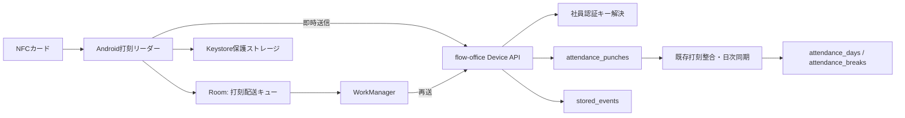
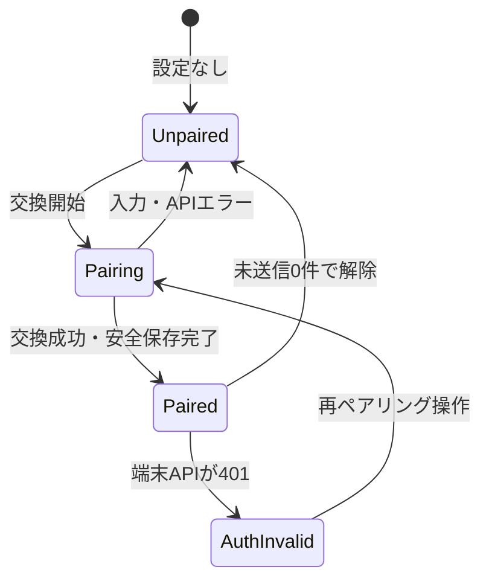
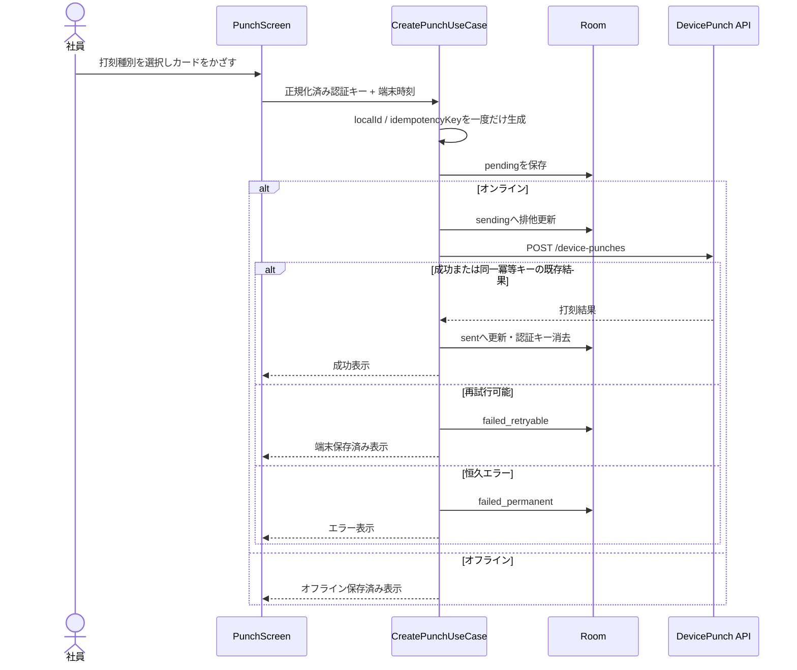

# Android打刻リーダー 基本・詳細設計

| 項目 | 内容 |
|---|---|
| 対象 | `flow-office-android-app` 初期版(共有端末モード) |
| 参照システム | `flow-office`(Laravel API / Sanctum / EventStore) |
| 作成日 | 2026-07-19 |
| ステータス | Android実装中(Phase 1基盤・ペアリングUI着手)。API契約は`flow-office`ブランチ`claude/time-clock-recorder-app-design-2lwxqb`(2026-07-19確認)を基準とする |

## 1. 目的

本アプリは、受付等に設置したAndroid端末でNFCカードを読み取り、既存勤怠管理システム
`flow-office`へ出勤・退勤・休憩開始・休憩終了の打刻イベントを送る打刻リーダーである。

初期版は共有端末を完全対象とする。端末のBearerトークンは「どの端末か」を認証し、NFC等の
認証キーは「誰が打刻したか」を解決する。Android側では勤務時間や残業時間を計算せず、打刻の
採取・永続化・配送と結果表示だけを担う。

## 2. 参照資料と現行調査結果

### 2.1 参照資料

- Android打刻リーダー実装指示書(ユーザー提供)
- `flow-office` の [アーキテクチャ方針](../../flow-office/docs/03-architecture.md)
- `flow-office` の [勤怠管理ユースケース](../../flow-office/docs/07-usecases-attendance.md)
- `flow-office` の [DBスキーマ](../../flow-office/docs/16-database-schema.md)
- `flow-office` の [端末管理ユースケース](../../flow-office/docs/23-usecases-devices.md)
- `flow-office` の [認証キー管理ユースケース](../../flow-office/docs/24-usecases-authentication-keys.md)
- 現行 [APIルート](../../flow-office/backend/routes/api.php)
- 現行 [AttendancePunchController](../../flow-office/backend/app/Http/Controllers/Api/AttendancePunchController.php)
- 現行 [RecordAttendancePunchHandler](../../flow-office/backend/app/Domain/Attendance/Handlers/RecordAttendancePunchHandler.php)

### 2.2 現行実装で確認できた事項

| 項目 | 現行仕様 |
|---|---|
| API基底 | `/api` |
| 認証 | Laravel Sanctum Bearerトークン |
| 通常ユーザー打刻ログ | `POST /api/attendance-punches` |
| 打刻種別 | `clock_in`, `break_start`, `break_end`, `clock_out` |
| 時刻 | オフセット必須ISO 8601。DBには協定時刻と`utc_offset_minutes`を分離保存 |
| 打刻ログの位置付け | 参照ログ。勤怠の正は`attendance_days` / `attendance_breaks` |
| 整合時の反映 | 同一勤務日の打刻列が整合した場合のみ日次勤怠へ同期 |
| 書き込み原則 | Command → Handler → EventStore。状態変更はイベントを記録 |
| 共有端末登録 | `POST /api/devices`(管理者用) |
| ペアリング発行／claim | `POST /api/devices/{id}/pairing` / `POST /api/devices/pairing/claim` |
| 端末打刻 | `POST /api/device-punches`、ability `recorder:punch` |
| 本人特定 | `POST /api/devices/identity/resolve` |
| ハートビート | `POST /api/devices/heartbeat` |
| 端末ID | `HasUuids`によるUUID文字列(36桁) |

### 2.3 Android連携APIの実装状況と差分

参照ブランチでは、`devices`、`device_roles`、`device_scopes`、`authentication_keys`、
`authentication_key_device_rules`と端末打刻用カラムが実装済みである。端末APIは人間向けの
`AttendancePunchController`と分離され、最終的に共通の`RecordAttendancePunch` Commandを呼ぶ。

Androidは「指示書の想定JSON」ではなく、次の現行差分に合わせる。

| 項目 | 指示書の想定 | 現行バックエンド |
|---|---|---|
| ペアリング成功トークン | `access_token` | `token` |
| 端末所有区分 | `shared` | `organization_shared` |
| 端末ID | 例では数値 | 数値で確定 |
| 打刻成功 | 社員表示名を想定 | `AttendancePunchResource`に氏名と勤怠サマリーを付加 |
| heartbeat本文 | OS、件数、端末時刻等 | `app_version`だけを受信 |
| エラー分岐 | `error_code`を推奨 | 現状は主に422の`message` |
| 冪等性 | 端末単位を想定 | `idempotency_key`単独の全体UNIQUE |

残りの差分はAndroid実装を止めない。DTOを現行に合わせ、氏名と勤怠サマリーはnullable、heartbeatは
`app_version`だけを送り、エラーはHTTP statusを第一判定、既知messageを補助判定とする。
安定した`error_code`等への改善提案は19節へ分離する。

## 3. スコープ

### 3.1 初期版に含める

- 共有端末の手入力ペアリング
- 端末トークンの暗号化保存
- NFC UID読取の正規化・連続読取抑止
- 4種類の打刻
- API送信前のRoom保存
- オフライン保存とWorkManager再送
- 同一イベントの冪等送信
- オンライン(未送信件数)・結果表示
- 401時の再ペアリング誘導
- ハートビート
- 設定・診断・安全なペアリング解除
- 単体・DB・通信・Worker・Compose UIテスト

### 3.2 初期版に含めない

- バーコード、BLE、生体認証の読取
- 打刻種別の自動推定、Android側での勤務・残業・深夜時間計算
- 個人端末用ユーザートークンの恒久保存、厳密なリアルタイム端末監視
- MDM配布・キオスク化など将来の運用課題

## 4. システム構成



### 4.1 責務境界

| Android | flow-office |
|---|---|
| NFC等から認証キーを採取 | 認証キーから社員を特定 |
| 操作時刻とUTCオフセットを採取 | 入力検証・認可・監査 |
| 打刻イベントを送信前に永続化 | 冪等性を保証して打刻ログを記録 |
| 通信失敗時に同じキーで再送 | 打刻列から日次勤怠を組み立てる |
| サーバー結果を表示 | 勤務時間等を計算 |

## 5. Androidアーキテクチャ

### 5.1 採用技術

- Kotlin、Jetpack Compose、Material 3
- ViewModel、Lifecycle、Navigation Compose
- Coroutines / Flow
- Hilt
- Retrofit、OkHttp、kotlinx.serialization
- Room
- WorkManager
- Android Keystoreを利用した暗号化ストレージ
- Android NFC API

基本方針は、Keystore内の非エクスポート鍵でトークンをAES-GCM暗号化し、暗号文・IV・鍵バージョン設定を
DataStoreへ保存する方式とする。暗号化ストレージは`DeviceTokenStore` interfaceの内側へ閉じ込め、
採用ライブラリを変更してもapplication/domain層へ影響させない。

### 5.2 モジュール方針

初期版は単一`app` Gradleモジュールとし、パッケージで責務を分割する。要望が増えた時点で
`core:network`、`core:database`等へ分割できる依存方向を定める。

```text
jp.co.xsys.flowoffice
├── app
│  ├── FlowOfficeReaderApplication
│  ├── MainActivity
│  └── navigation
├── presentation
│  ├── pairing
│  ├── punch
│  ├── settings
│  └── diagnostics
├── application
│  ├── pairing
│  ├── punch
│  ├── sync
│  └── heartbeat
├── domain
│  ├── device
│  ├── identity
│  ├── punch
│  └── error
├── data
│  ├── remote
│  ├── local
│  ├── repository
│  └── security
└── infrastructure
    ├── nfc
    ├── network
    ├── worker
    └── logging
```

依存方向は`presentation → application → domain`とし、`data`と`infrastructure`はdomainで定義した
interfaceを実装する。ViewModelからRetrofitやDAOを直接呼ばない。

### 5.3 主なコンポーネント

| コンポーネント | 責務 |
|---|---|
| `PairingViewModel` | 入力検証、交換UseCase実行、画面遷移 |
| `PunchViewModel` | 打刻種別、NFC待受、送信・未送信・結果のUI状態 |
| `DiagnosticsViewModel` | 秘密鍵・端末状態・失敗キュー表示 |
| `ExchangePairingCodeUseCase` | コード交換、トークンと端末設定の一括保存 |
| `CreatePunchUseCase` | イベント生成、Room保存、即時送信 |
| `RetryPendingPunchesUseCase` | 古い打刻から1件ずつ配送、状態分類 |
| `SendHeartbeatUseCase` | 稼働情報送信 |
| `NfcAuthenticationKeyReader` | Tag ID読取とdomain型への変換 |
| `DeviceTokenStore` | トークンの暗号化・復号・削除 |
| `PunchSyncWorker` | ネットワーク制約付き再送 |

## 6. ドメインモデル

```kotlin
@JvmInline
value class DeviceId(val value: Long)

data class AuthenticationKey(
    val type: AuthenticationKeyType,
    val rawValue: String,
)

enum class AuthenticationKeyType { NFC_UID, QR_CODE, BARCODE, EXTERNAL, UNKNOWN }

enum class PunchType(val apiValue: String) {
    CLOCK_IN("clock_in"),
    CLOCK_OUT("clock_out"),
    BREAK_START("break_start"),
    BREAK_END("break_end"),
}

enum class DeviceOwnershipType { SHARED, PERSONAL, EXTERNAL }

data class PunchEvent(
    val localId: String,
    val idempotencyKey: String,
    val workDate: LocalDate,
    val punchType: PunchType,
    val punchedAt: OffsetDateTime,
    val authenticationKeyValue: String?,
    val offlineAtCreation: Boolean,
    val note: String?,
)
```

`flow-office`の`devices.id`・`users.id`は`HasUuids`によるUUID文字列(36桁、ハイフン区切り)として
実装済みなので、Androidも`String`で保持し、`Long`へ変換しない。

## 7. 状態設計

### 7.1 アプリ(ペアリング)状態



401だけでトークンを削除しない。`AuthInvalid`では自動送信を停止し、未送信データを維持したまま
管理者確認と再ペアリングを促す。

### 7.2 打刻配送状態

| 状態 | 意味 | 次の状態 |
|---|---|---|
| `pending` | 送信待ち | `sending` |
| `sending` | 排他取得後の送信中 | `sent`, `failed_retryable`, `failed_permanent`, `pending_auth` |
| `failed_retryable` | 通信例外、5xx、429等 | `sending` |
| `pending_auth` | 401で認証復旧待ち | 再ペアリング後に`pending` |
| `failed_permanent` | 422等、同じ内容では成功しない | 手動確認のみ |
| `sent` | サーバー受理済み | 終端 |

プロセス強制終了で`sending`が残る場合に備え、開始から一定時間(例: 10分)経過した行を
`failed_retryable`へ戻すリカバリをWorker起動時に行う。

## 8. NFC設計

### 8.1 読取

- 端末がNFC対応か、設定で有効かを診断画面へ表示する。
- Compose画面表示中はReader Modeを有効化し、画面離脱時に解除する。
- UIDのバイト列を大文字16進、区切り・空白・`0x`なしへ正規化する。
- 空のUID、対応外Tag、読取例外は打刻イベントを作らない。
- NFC UIDは高保証の本人認証ではなく識別キーとして扱う。

```kotlin
fun ByteArray.toNormalizedNfcUid(): String =
    joinToString(separator = "") { byte -> "%02X".format(byte.toInt() and 0xFF) }
```

### 8.2 連続読取抑止

- 同じ正規化済みキーの再読取を3秒間無視する。
- 判定値はメモリ上だけに置き、UID自体をログへ出さない。
- 3秒抑止はUX対策であり、サーバーの冪等性の代替にはしない。
- 1回の有効読取につき1つの`idempotency_key`だけを生成する。

## 9. ローカルデータ設計

### 9.1 `pending_punches`

| カラム | 型 | 制約・用途 |
|---|---|---|
| `local_id` | TEXT | PK、UUID v7推奨 |
| `idempotency_key` | TEXT | UNIQUE、全体中に一意 |
| `work_date` | TEXT | `YYYY-MM-DD` |
| `punch_type` | TEXT | 4種類 |
| `punched_at` | TEXT | オフセット付きISO 8601 |
| `authentication_key_value` | TEXT | 送信完了まで必要。ログ・画面に非表示 |
| `note` | TEXT NULL | 任意 |
| `offline_at_creation` | INTEGER | 作成時通信状態 |
| `status` | TEXT | 配送状態 |
| `attempt_count` | INTEGER | 試行回数 |
| `last_attempt_at` | TEXT NULL | 最終試行時刻 |
| `last_error_code` | TEXT NULL | 安定したAPIエラーコード |
| `last_error_message` | TEXT NULL | 秘密を除去した診断文 |
| `server_punch_id` | TEXT NULL | 成功応答のID |
| `server_response_json` | TEXT NULL | 原則保存しない。必要項目だけを保存 |
| `created_at` | TEXT | ローカル保存時刻 |
| `sent_at` | TEXT NULL | サーバー送信完了時刻 |

認証キーは未送信中に必要な個人識別データである。DB暗号化を初期版で採用しない場合は、
アプリ専用内部ストレージ、バックアップ対象外、`sent`後のキー消去、短い保持期間を必須とする。
`sent`行は診断に必要な最小情報だけ残し、定期的に削除する。

### 9.2 `device_configuration`

端末ID、端末名、ownership、API基底URL、pairedAtをDataStoreへ保存する。Bearerトークンだけは
暗号化して別キーで保存し、設定データのdumpに混在させない。API基底URL変更は開発ビルドだけ
許可し、本番はビルド設定で固定する。

### 9.3 Roomトランザクションと排他

1. NFC受信時に`pending`をinsertする。
2. 送信処理はDBトランザクションで最古の送信対象を`pending/failed_retryable`から`sending`へ更新する。
3. 即時送信とWorkerは同じ配送クラスを使い、同じ行を同時送信しない。
4. 成功・失敗更新もトランザクションで行う。

## 10. 通信・同期設計

### 10.1 HTTPクライアント

- Base URLは末尾`/`を正規化し、共通で`Accept: application/json`を付ける
- claim APIはQRのclaim tokenをBearer認証として付け、リクエストボディを送らない
- 端末APIは保存済みの本トークンをBearer認証として付ける
- Authorization、claim token、認証キーをログへ出さず、通信例外を`AppError`へ変換する

### 10.2 打刻シーケンス



### 10.3 WorkManager

- `NetworkType.CONNECTED`制約を使う。
- Unique Work名を固定し、重複Workerを避ける。
- オンデマンド送信と定期再送を同じUseCaseへ接続する。
- `punched_at`, `created_at`昇順で1件ずつ送る。
- 429の`Retry-After`を尊重し、それ以外は指数バックオフを使う。
- Workerの入力Dataにトークンや認証キーを渡さず、DBの`local_id`だけを渡す。
- 401を受けたら後続送信を止める。

### 10.4 work_date

現行`flow-office`では「勤務日」を社員の`users.timezone`で決めるが、共有端末は認証キーを解決する
前に社員のtimezoneを知らない。深夜の日跨ぎもあるため、端末ローカル日付だけでは確定できない。

現行バックエンドは送信された`work_date`をそのまま保存し、社員timezoneや勤務予定による補正は
行わない。初期実装は端末ローカル日付を使い、深夜・日跨ぎは既知の制約として診断情報へ残し、
勤務日判定APIまたは端末別の勤務日境界がバックエンドへ追加された段階でresolverを差し替える。

## 11. API契約(現行実装)

本節は`flow-office`のController、Resource、Feature Testで確認した現行契約である。レスポンスに
存在しない値はAndroid DTOでnullableにし、推測で必須化しない。

### 11.1 ペアリング交換

`POST /devices/pairing/claim`はclaim tokenをBearer認証として呼ぶ。QR定義は次のURLとする。
claim tokenは5分間有効で、一度交換すると再利用できない。端末IDをQRやリクエスト本文へ含めず、
claim tokenに紐づくバックエンドの`devices.id`を成功レスポンスから取得する。

```text
https://office.example.jp/flow-office/api/devices/pairing/claim?claim_token=<一時トークン>
```

Androidが初回起動時に生成するUUIDは`appInstanceId`であり、バックエンド採番のUUID文字列
`devices.id`とは別の識別子として保持する。`devices.id`・`users.id`は`HasUuids`によるUUID文字列
(36桁、ハイフン区切り)であり、整数の連番ではない。Android側は`device_id`、`user_id`、
`authentication_key_id`など全ての識別子を`String`として扱い、`Long`へ変換しない。

```json
{
  "device": {
    "id": "3fa85f64-5717-4562-b3fc-2c963f66afa6",
    "owner_type": "organization_shared",
    "name": "名古屋本社入口",
    "device_type": "android",
    "status": "active",
    "allowed_punch_types": null,
    "allow_offline": true,
    "auto_detect_punch_type": false,
    "paired_at": "2026-07-19T09:00:00+09:00"
  },
  "token": "1|...",
  "api_base_url": "https://office.example.jp/flow-office/api"
}
```

Android DTOは`access_token`ではなく`token`を読む。交換時点で端末role由来のSanctum ability
(共有端末は`*`、外部端末は`recorder:punch`)が発行される。以降のAPI呼び出しに使う
ベースURLはQRのURLから切り出さず、成功レスポンスの`api_base_url`を保存する。

### 11.2 本人特定

`POST /api/devices/identity/resolve`(ability `identity:resolve`または`recorder:punch`)

```json
{ "authentication_key_value": "04A22419CC2180" }
```

```json
{
  "user_id": "3fa85f64-5717-4562-b3fc-2c963f66afb1",
  "name": "山田 太郎",
  "authentication_key_id": "3fa85f64-5717-4562-b3fc-2c963f66afb2"
}
```

通常打刻は`POST /device-punches`内で認証キーを再解決する。本人特定APIは診断または特殊な
事前表示モードだけに使い、その結果を打刻の認証済み証明として扱わない。

### 11.3 端末打刻

`POST /api/device-punches`(共有端末はability `recorder:punch`)

```json
{
  "work_date": "2026-07-19",
  "punch_type": "clock_in",
  "punched_at": "2026-07-19T09:00:12+09:00",
  "authentication_key_value": "04A22419CC2180",
  "offline": false,
  "idempotency_key": "019bbcae-a85b-7000-9d28-82ea9dfe8c21",
  "note": null
}
```

共有端末では`authentication_key_value`が実質必須である。成功は現状`200 OK`で
`AttendancePunchResource`を返す。

```json
{
  "id": "3fa85f64-5717-4562-b3fc-2c963f66afb3",
  "user_id": "3fa85f64-5717-4562-b3fc-2c963f66afb1",
  "work_date": "2026-07-19",
  "punch_type": "clock_in",
  "punched_at": "2026-07-19T09:00:12+09:00",
  "source": "device:android",
  "device_id": "3fa85f64-5717-4562-b3fc-2c963f66afa6",
  "authentication_key_id": "3fa85f64-5717-4562-b3fc-2c963f66afb2",
  "actor_user_id": "3fa85f64-5717-4562-b3fc-2c963f66afb1",
  "offline": false,
  "note": null,
  "status": "active",
  "created_at": "2026-07-19T09:00:13+09:00",
  "user_name": "山田 太郎",
  "attendance_summary": {
    "work_minutes": null,
    "missing_punch_count": 1,
    "current_day_incomplete": false
  }
}
```

`user_name`は打刻した社員の表示名である。`attendance_summary.work_minutes`は退勤で日次勤怠が
整合した場合のみ分数を返す。`missing_punch_count`は当日を除く過去31日間の未退勤件数、
`current_day_incomplete`は退勤操作後も打刻列が整合しなかった場合の確認フラグである。Androidは
これらを短時間の結果表示だけに使い、勤務時間を端末側で再計算しない。
同一`idempotency_key`の再送は既存行を返し、新しい打刻を作らない。

### 11.4 ハートビート

`POST /api/devices/heartbeat`は`auth:sanctum`配下で、共有端末の`recorder:punch`でも呼べる。
現行の受信本文は次だけである。

```json
{ "app_version": "1.0.0" }
```

成功時は更新後の`DeviceResource`を`200 OK`で返し、サーバーが`last_seen_at`を更新する。
OSバージョン、未送信件数、端末時刻は現行APIへ送らない。

### 11.5 エラー本文

Laravel validationは`message`と`errors`、ドメインルール違反は主に`message`を返す。安定した
`error_code`は未実装のため、Androidの制御はHTTP statusを第一にする。422の利用者向け文言は
認証キー関連など安全と確認できた既知ケースだけを変換し、未知のサーバー文言はそのまま表示しない。

## 12. バックエンド連携設計(実装確認)

### 12.1 認証と認可

- `Device`はSanctum `HasApiTokens`を持つ認証主体である。
- 個人向け通常トークンはability `*`、共有打刻端末は`recorder:punch`で分離される。
- 限定トークンはabilityが明記されたルート以外をグローバルmiddlewareで拒否する。
- `DevicePunchController`は認証主体が`Device`であることを確認し、共有端末では認証キーから社員を解決する。
- 個人端末は`owner_user_id`本人として打刻し、認証キーを要求しない。
- 停止・失効処理は端末のSanctum tokenを削除するため、以降は401になる。

### 12.2 実装済みデータ

| テーブル(概目) | 用途 |
|---|---|
| `devices` | UUID文字列ID、owner、type、status、設定、heartbeat、ペアリング情報 |
| `device_roles` | `attendance_reader`等。token abilityの元 |
| `device_scopes` | 外部端末向け個別scope |
| `authentication_keys` | 社員認証キー。生値は保存せずHMAC-SHA-256 |
| `authentication_key_device_rules` | キーを利用可能な端末(site)の制限 |
| `attendance_punches.device_id` | 打刻元端末 |
| `attendance_punches.authentication_key_id` | 解決に使ったキー |
| `attendance_punches.offline` | オフライン発生フラグ |
| `attendance_punches.idempotency_key` | nullable、全体UNIQUE |

### 12.3 打刻処理

1. route middlewareがSanctum abilityを検証する。
2. 共有端末は認証キーをHMAC化し、有効期間・status・device ruleを検証する。
3. `RecordAttendancePunchHandler`が同じ`idempotency_key`の既存行を検索し、あれば返す。
4. offset付き時刻を協定時刻と`utc_offset_minutes`へ分離して保存する。
5. `attendance_punch.recorded`相当の既存イベントをEventStoreへ追記する。
6. `AttendanceDayPunchSyncer`が整合する打刻列だけを日次勤怠へ反映する。

端末登録・ペアリング・停止・失効・認証キー発行(無効化)はCommand/EventStore方針に沿う。
heartbeatは高頻度テレメトリとして意図的に直接更新される。

### 12.4 Androidが依存してよい契約

Androidが直接依存してよいのは、URL、HTTP method、request/response DTO、status code、Sanctum Bearer
だけとする。バックエンドのEloquent名、event名、HMAC方式をAndroidへ複製しない。認証キーは
正規化済み生値をTLS上で送り、ハッシュ化と社員解決は常にサーバーへ任せる。

## 13. HTTPエラー分岐

| 条件 | ローカル状態 | 再送 | UI |
|---|---|---|---|
| 2xx | `sent` | なし | 成功 |
| 同一冪等キーの既存成功 | `sent` | なし | 成功 |
| 400 | `failed_permanent` | なし | 入力不正 |
| 401 | `pending_auth` | 認証復旧まで停止 | 再ペアリング案内 |
| 403 | `failed_permanent` | 自動なし | 端末権限を管理者へ確認 |
| 404 | `failed_permanent` | なし | 一般エラー(認証キー不明か現状422) |
| 409 | `failed_permanent` | なし | 一般エラー(現行打刻APIは通常返さない) |
| 422 | `failed_permanent` | なし | validation(認証キーエラーの安全な定型文) |
| 429 | `failed_retryable` | `Retry-After`後 | 端末保存済み |
| 5xx | `failed_retryable` | 指数バックオフ | 端末保存済み |
| timeout/IO例外 | `failed_retryable` | 指数バックオフ | 端末保存済み |

API内部の例外文、スタックトレース、URL、トークンは利用者向け画面へ表示しない。

## 14. UI設計

### 14.1 ナビゲーション

```text
起動
├─ 未ペアリング ─ PairingScreen
└─ ペアリング済み ─ PunchScreen
                       ├─ SettingsScreen
                       └─ DiagnosticsScreen
```

### 14.2 PairingScreen

- APIサーバーURL(debugのみ編集可)
- 端末ID
- QRコード読み取りを主操作とし、カメラを使えない場合はAPI URLとclaim tokenの貼り付けを提供する
- QRのJSONを検証し、claim処理中・成功・期限切れ・無効QR・通信エラーを区別して表示する
- QR入力を後付けできる`PairingInputSource` interface
- コード表示中・診断画面では必要に応じ`FLAG_SECURE`

成功は「トークン暗号化保存 + 端末設定保存」が両方完了した時点とする。片方だけ失敗した場合は
ローカル情報をロールバックし、交換済みコードの再利用不可を説明して管理者へ再発行を依頼する。

### 14.3 PunchScreen

- 端末名、現在時刻、オンライン状態、未送信件数
- 4種類の大きな打刻種別ボタン
- 利用可能領域が横長（幅 > 高さ）の場合は、出勤・休憩開始・休憩終了・退勤の順で1行表示
- 選択中種別と「社員証をかざしてください」
- NFC無効・非対応の明確な案内
- 成功、オフライン保存、未送信エラーを色・アイコン・文字・音・振動の複数手段で通知
- 成功表示は2〜3秒後に待受へ戻る
- 処理中の種別変更と二重読取を抑止するが、UIフリーズはさせない

「オフライン保存」はサーバーでの打刻完了ではないため、文言を分ける。

```text
オフラインで打刻を保存しました
通信復旧後に自動送信します
```

### 14.4 DiagnosticsScreen

表示してよいもの:

- アプリ・Androidバージョン
- 端末ID(必要な末尾のみ)、端末名、ownership・pairing状態
- APIホスト名(秘密を含むquery等は除外)
- 最終成功通信、最終heartbeat、未送信件数
- NFC対応の有効状態、ネットワーク状態
- 端末側で生成した相関ID、HTTP status、秘密を除去した診断コード

表示しないもの:

- Bearerトークン、ペアリングコード
- 完全なNFC UID・認証キー
- 個人名と認証キーの対応
- スタックトレース

## 15. セキュリティ・プライバシー

- releaseはHTTPSのみ。Cleartext許可はdebugの限定hostだけにする。
- トークンはKeystore保護、バックアップ対象外、ログ・analytics・crash reportへ非送信。
- pairing code、認証キー、AuthorizationをOkHttpログからredactする。
- `android:allowBackup`またはdata extraction rulesで秘密とRoomを除外する。
- releaseでdebuggableを無効化する。
- 画面キャプチャ制限はPairing・Diagnosticsへ適用を検討する。
- 端末紛失時は管理画面でdeviceを停止し、Sanctum tokenを失効できるようにする。
- NFC UIDは複製可能であり、金融等の高保証認証には利用しない。
- 端末時刻改ざん対策として`punched_at`、offset、local created、sent、server receivedの
  自動時刻設定状態(取得可能時)を診断可能にする。
- 認証キーの保存期間と送信済み履歴の削除期間を運用ルールとして定める。

## 16. ハートビート

送信契機は起動、フォアグラウンド復帰(前回から一定時間経過時)、定期Worker、必要に応じ打刻成功後とする。
端末側で最終送信時刻を持ち、短時間の多重送信を抑止する。現行APIへ送る本文は`app_version`だけとし、
未送信件数、OSバージョン、端末時刻はAndroidの診断画面内だけで管理する。

ハートビート失敗は打刻を妨げない。401だけは端末認証状態へ反映し、それ以外は次回へ持ち越す。

## 17. テスト設計

### 17.1 Unit

- NFC UIDの符号拡張を含む大文字16進正規化
- 空UID、同一UIDの3秒デバウンス
- 4種のAPI値変換
- offset付き時刻の保持(端末timezoneへの再変換をしない)
- idempotency keyが再送で変化しない
- work_date resolverの優先順位
- HTTP statusと安全な既知messageから`AppError`・配送状態への分岐
- トークンや認証キーのログサニタイズ

### 17.2 Room

- idempotency unique制約
- insert後にpendingとなる
- 最古順の排他取得
- sendingのstale recovery
- 成功・再試行・恒久失敗・認証待ち更新
- アプリ再起動後もキューが残る
- sent後に認証キーが消去される

### 17.3 Repository / MockWebServer

- URL、method、JSON、Accept、Content-Type
- 端末APIだけBearerが付く
- pairing claimにはclaim tokenのBearerが付き、リクエストボディはない
- Authorization、認証キーがテストlogger出力にも現れない
- 200、401、403、404、422、429、5xx、不正JSON、timeoutを検証する
- Retry-After解釈

### 17.4 Worker

- CONNECTED制約
- 1件ずつ時系列送信
- 401で後続停止
- retryableだけ再試行
- Unique Workで多重実行しない

### 17.5 Compose UI / 計測テスト

- 未ペアリング時の初期画面
- 成功後のPunchScreen遷移
- 4種選択と選択表示
- オフライン表示・未送信件数
- 成功・エラー・401案内
- 未送信ありのペアリング解除禁止
- NFC無効・非対応表示

### 17.6 バックエンドFeature Test(現行確認・追加推奨)

- コードの期限、誤コード、交換成功(実装済み)。多重利用の並行試験とrate limitは追加推奨
- Device tokenのabilityとstatus
- ユーザートークンで端末APIを呼べないこと
- 認証キー解決、無効キー、重複キーの拒否
- 同一冪等キーの逐次再送(実装済み)
- 同一冪等キーの並行競合、別payload・別device再利用の拒否(追加推奨)
- offset保存と既存打刻同期
- 全状態変更で所定のstored eventが記録されること

## 18. 実装フェーズ

| Phase | Android | バックエンド依存(完了条件) |
|---|---|---|
| 0 契約確認 | 現行DTO固定、MockWebServer fixture作成 | 参照ブランチのFeature Testを確認 |
| 1 基盤 | Compose、Hilt、Room、Retrofit、Build Variant | mock APIで起動・CI成功 |
| 2 ペアリング | 画面、安全保存、状態遷移 | 実装済みexchange APIと接続 |
| 3 打刻 | NFC、種選択、事前保存、即時送信 | 実装済みdevice punch APIと接続 |
| 4 オフライン | Worker、状態分類、再送、待機等 | 現行の同一キー再送仕様と接続 |
| 5 運用 | heartbeat、診断、解除、保持期間 | heartbeatは実装済み。端末側解除方針を確定 |
| 6 個人端末 | ownership分岐 | `POST /users/me/devices`は実装済みだが個人端末完成待ち |

各Phaseでunit test、該当instrumentation test、README更新を同時に行う。

## 19. 確定事項・残課題・バックエンド改善提案

### 19.1 実装着手に必要な契約(確定済み)

- Device ID・User IDは`HasUuids`によるUUID文字列(36桁)、ownershipは`organization_shared`
- ペアリングはQR URLの`claim_token`を使い、`device`、本`token`、`api_base_url`を受け取る
- Android生成UUIDの`appInstanceId`はDevice IDとは別の補助識別子
- 共有端末tokenは`Device`を主体とするSanctum tokenで、abilityは`recorder:punch`
- 端末打刻は現行`AttendancePunchResource`を200で返し、heartbeatは`app_version`を受け付ける

### 19.2 Android初期版で決める事項

1. 送信済み行、未送信エラー行、認証キー値の保持期間
2. サーバー側revoke APIを端末自身から呼べない現状での「ペアリング解除」の運用
3. 端末時刻ずれの警告閾値
4. 打刻結果の氏名・勤怠サマリーを表示する時間(既定は3秒)
5. 本番API URL、minSdk、targetSdk、対応端末のNFC要件

### 19.3 バックエンド改善提案(Android実装は待たない)

1. `idempotency_key`を`(device_id, idempotency_key)`でscopeし、request payload hashを照合する。
2. 同一冪等キーの並行送信をDB一意制約だけではなく既存結果として安全に扱う。
3. 別payloadで同じキーを使った場合は409等で拒否し、既存打刻を成功扱いで返さない。
4. ペアリング交換をトランザクション(行ロック)で冪等化し、IP・device単位のrate limitを付ける。
5. `error_code`と`request_id`を共通エラー契約へ追加する。
6. 成功レスポンスへ未実装の`idempotency_key`、サーバー受信時刻を追加する。
7. `work_date`の日跨ぎルール、未来・過去時刻、オフライン許容期間をサーバー側で検証する。
8. `allowed_punch_types`と`allow_offline`を`DevicePunchController`で強制する。
9. heartbeatへOS、未送信件数、端末時刻を追加するか、現行の簡易仕様を正式化する。
10. NFC UIDの正規化をキー種別ごとに統一する。現行サーバーはtrim・大文字化のみなので、登録値と
    Androidと同じ「区切りなし大文字16進」に揃えないと照合できない。

### 19.4 将来

- 打刻種別の自動推定
- 個人端末モードのUIとユーザーSSO連携
- MDM、キオスクモード、証明書pinningの運用可否

## 20. 初期版の完了条件

- 管理画面で登録済みの共有端末を、端末IDとコードでペアリングできる。
- トークンを平文でログ・リポジトリへ残さない。
- NFC UIDを指定要領で読み、4種の打刻を選べる。
- すべての打刻がAPI送信前にRoomへ保存される。
- オフラインでも受付でき、通信復旧後に同じ冪等キーで自動送信される。
- 同一打刻の再送でサーバーに二重登録されない。
- 成功、端末保存、未送信エラー、認証失効を利用者が区別できる。
- 401時も未送信打刻を失わず再ペアリングへ誘導できる。
- heartbeatと診断画面が診断情報を提供できる。
- Androidとバックエンドの契約テストが通る。
- `flow-office`のEventStore、日時、打刻ログ・日次勤怠分離の原則を崩さない。
